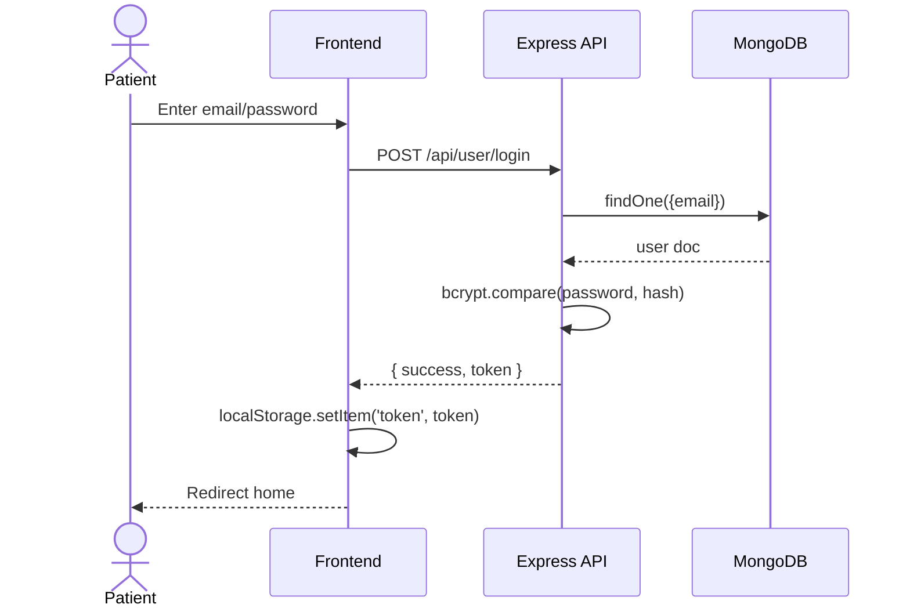
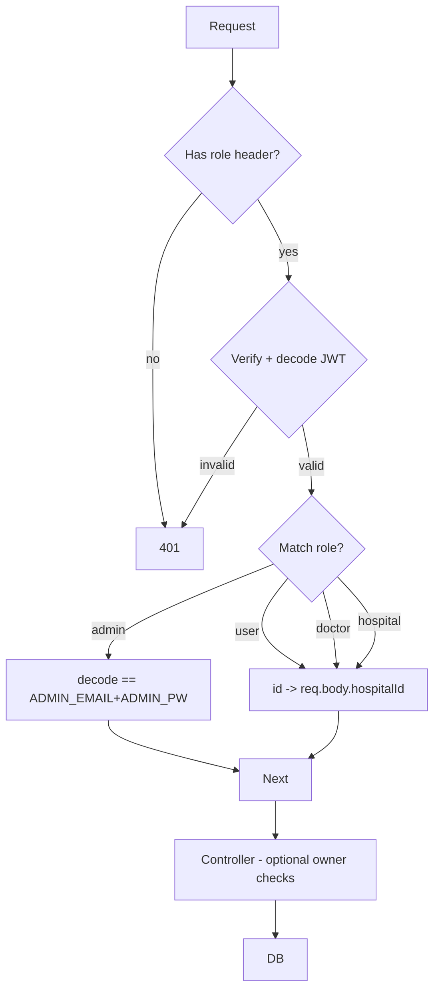
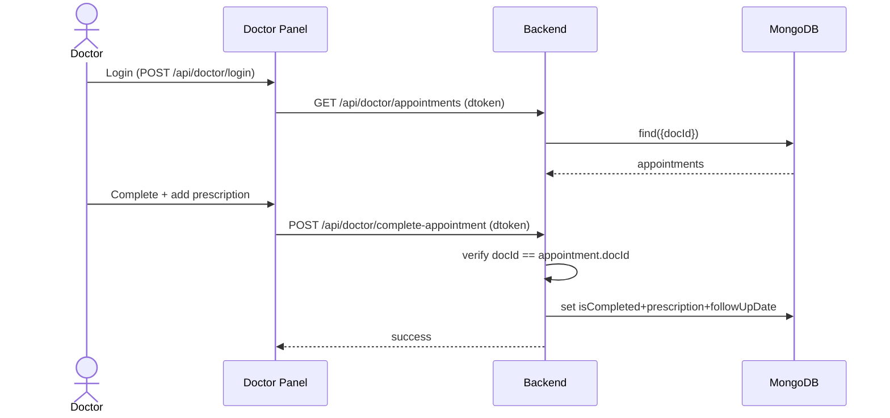
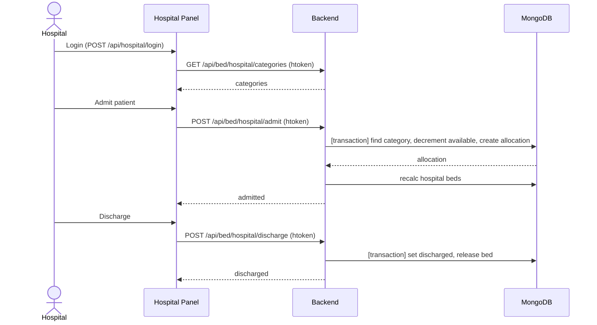
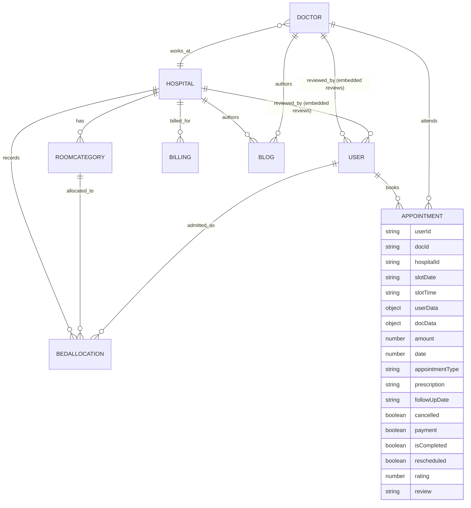

# HEALHUB
## PRODUCT, BUSINESS & TECHNICAL BLUEPRINT
### Version 1.0

---

# Document Control

| Field | Value |
|-------|-------|
| **Product** | Healhub |
| **Document** | Product, Business & Technical Blueprint |
| **Version** | 1.0 |
| **Date** | 03 September 2026 |
| **Status** | Baseline / Current-State Assessment |
| **Primary Source** | Healhub source code (local workspace) |
| **Supporting Sources** | Repository documentation, configuration, env templates |
| **Scope** | Product, business, functional, technical, security, data, analytics, roadmap assessment |
| **Classification** | Internal — Evidence-based |

### Repository Review Baseline

| Repository | Role | Branch (last local commit) | Evidence Depth |
|------------|------|---------------------------|----------------|
| `backend` | Express API server | `c6d1bc9` | HIGH |
| `frontend` | Patient-facing React SPA | `27aa7f8` | HIGH |
| `admin` | Role-based Admin/Doctor/Hospital panel (React SPA) | `53191e0` | HIGH |

> **Methodology statement:** Documentation methodology is adapted from the supplied reference BRD. All Healhub business, functional and technical content is independently derived from the Healhub codebase and is **not copied** from the reference domain.

### Evidence Confidence Legend

| Level | Meaning |
|-------|---------|
| **HIGH** | Directly confirmed from source implementation. |
| **MEDIUM** | Supported by multiple implementation/documentation signals. |
| **LOW** | Reasonably inferred but not fully confirmed. |
| **UNKNOWN** | Unable to determine from the current codebase. |

---

# Table of Contents

1. Executive Summary
2. Product Overview
3. Problem Statement
4. Vision, Mission & Product Philosophy
5. Target Users & Stakeholders
6. Product Positioning & Differentiation
7. Product / System Architecture
8. User & Identity
9. Core Business Modules
10. Intelligence / Automation Assessment
11. Provider / Doctor / Hospital Platform
12. Administration & Moderation
13. Trust, Safety, Security & Governance
14. Search, Discovery & Communication
15. Analytics & KPIs
16. Core User Journeys
17. Major Business Workflows
18. Data Architecture
19. API & Integration Architecture
20. Technical Architecture
21. Security & Non-Functional Requirements
22. User Roles & Permissions
23. Current-State Assessment
24. Functional Gaps
25. Technical Debt
26. Risks & Mitigation
27. Current vs Target State
28. Roadmap
29. Product Principles
30. Final Product Positioning

Appendix A — Complete Feature Inventory
Appendix B — User Role & Permission Matrix
Appendix C — Business Requirements
Appendix D — Functional Requirements
Appendix E — Non-Functional Requirements
Appendix F — Security Requirements
Appendix G — Data Requirements
Appendix H — Integration Requirements
Appendix I — Business Rules
Appendix J — API Inventory
Appendix K — Data Dictionary
Appendix L — KPI Dictionary
Appendix M — Traceability Matrix
Appendix N — Risk Register
Appendix O — Technical Debt Register
Appendix P — Glossary
Appendix Q — Open Questions / Decisions
Appendix R — Evidence Map

---

# 1. Executive Summary

## What Healhub Is

Healhub is a **healthcare management and appointment-booking platform** built as a three-part web application: a **patient-facing frontend** (`frontend/`), a **role-based operational panel** (`admin/`) covering platform-admin, doctor, and hospital/clinic operations, and a **Node.js/Express REST API backend** (`backend/`) backed by MongoDB.

## What User Problem It Solves

The system connects **patients** with **doctors** and **hospitals/clinics** for appointment discovery and booking, and provides operational tooling for doctors, hospitals, and platform administrators (doctor/hospital management, appointment handling, room & bed allocation, billing, content, and analytics).

## Who Uses It

Four distinct actor groups are implemented:
1. **Patient/User** — patient-facing SPA.
2. **Doctor** — doctor panel in the admin SPA.
3. **Hospital/Clinic** — hospital panel in the admin SPA.
4. **Platform Admin** — admin panel in the admin SPA.

## Major Supported Workflows

- Patient registration & login; profile management; doctor/hospital discovery; appointment booking (in-person/video); appointment reschedule/cancel; online payment (Razorpay); rating/review; prescription viewing.
- Doctor login; appointment completion; prescription writing; schedule & blocked-date management; analytics & revenue view.
- Hospital login; doctor onboarding; room/bed category management; patient admission/discharge; billing generation; analytics; blogs.
- Admin login; doctor/hospital onboarding; appointment oversight; room/bed management; billing management; content moderation; analytics; dashboard.

## Current Product Surfaces

| Surface | Technology | Deployment Signal |
|---------|-----------|-------------------|
| Patient frontend | React 19 + Vite, Tailwind, React Router, Axios, Razorpay | Vercel (`vercel.json`), PWA manifest + service worker |
| Admin multi-role panel | React 19 + Vite, Tailwind, Recharts | Vercel |
| Backend API | Node.js + Express 5 + Mongoose | `Server.js` |

## Major Integrations

- **Razorpay** — appointment payment order creation & verification.
- **Cloudinary** — image upload/storage for users, doctors, hospitals, blogs.
- **MongoDB** — primary datastore.
- **Local app assets** — static images bundled in repo.

## Most Important Current Strengths

- Clear separation of three application surfaces.
- Backend-enforced role authorization (`authAdmin`, `authDoctor`, `authHospital`, `authUser` middleware) on sensitive endpoints.
- Meaningful analytics for admin, doctor, and hospital.
- Transactional bed allocation (`mongoose` sessions/transactions).
- Extensive role-scoped blog/content management.

## Major Limitations & Gaps

- **No router-level route protection** on either frontend; authorization is ad-hoc and, at the UI layer, purely cosmetic.
- **Payment verification is weak** (relies on `orders.fetch` status rather than signature verification) — see Section 13.
- **Admin JWT** embeds `email+password` in the token payload (secret leakage risk) — Section 13.
- **No email/SMS notifications** despite README claims; appointment booking is decoupled from payment (payment is post-booking).
- **Client tokens in `localStorage`** (XSS exposure), no token expiry configured.
- **Contract/consistency drift** across surfaces (currency ₹ vs $, field-name mismatches, duplicate slot logic) — Sections 24–25.
- **`.env` files and a test Razorpay key are committed to the repository.**

## Evolutions Indicated by Evidence

The codebase is being actively extended toward **hospital/clinic operations** (rooms, beds, admission/discharge, billing) and **content publishing** (role-scoped blogs), beyond a pure appointment-booking market. Analytics and rating/review features are the most recently expanded.

## CURRENT STATE vs RECOMMENDED FUTURE STATE

This document separates **current-state** (implemented, evidenced) functionality from **proposed/recommended future state**. All *[PROPOSED]* and *[FUTURE]* items are expressly not part of the current implementation.

---

# 2. Product Overview

Actual product capabilities as evidenced in the codebase.

| Product Area | Purpose | Current Status | Evidence |
|--------------|---------|----------------|----------|
| Patient registration | Create a user account | [IMPLEMENTED] | `userController.registerUser`, `userRoute POST /register` |
| Patient login | Authenticate patient | [IMPLEMENTED] | `userController.loginUser` |
| Doctor discovery | List/search doctors | [IMPLEMENTED] | `doctorController.doctorList`, `GET /api/doctor/list` |
| Hospital discovery | List/search hospitals w/ geo-filter | [IMPLEMENTED] | `hospitalController.listHospitals` |
| Hospital profile | Hospital + its doctors + room availability | [IMPLEMENTED] | `getHospitalProfile`, `getPublicRoomAvailability` |
| Appointment booking | Book in-person/video slot | [IMPLEMENTED] | `bookAppointment`, `POST /api/user/book-appointment` |
| Appointment reschedule | Change date/time | [IMPLEMENTED] | `rescheduleAppointment` |
| Appointment cancel | Cancel (user/admin/doctor) | [IMPLEMENTED] | `cancelUserAppointment`, `appointmentCancel`, `cancelDoctorAppointment` |
| Appointment completion | Mark completed + prescription | [IMPLEMENTED] | `completeDoctorAppointment`, `addPrescription` |
| Prescription | Free-text prescription + follow-up date | [IMPLEMENTED] | `appointmentModel.prescription, followUpDate` |
| Doctor availability | Weekly schedule + blocked dates | [IMPLEMENTED] | `updateDoctorSchedule`, `addBlockedDates`, etc. |
| Patient profile | View/update profile + image | [IMPLEMENTED] | `updateUserProfile`, `/api/user/update-profile` |
| Doctor profile | Update fees/address/availability | [IMPLEMENTED] | `updateDoctorProfile` |
| Hospital profile | Update hospital info + image | [IMPLEMENTED] | `updateHospitalProfile` |
| Bed/room management | Room categories CRUD | [IMPLEMENTED] | `bedController` admin + hospital variants |
| Patient admission | Allocate bed (transactional) | [IMPLEMENTED] | `admitPatient`, `hospitalAdmitPatient` |
| Patient discharge | Release bed | [IMPLEMENTED] | `dischargePatient`, `hospitalDischargePatient` |
| Billing | Generate period billing (commissions + bed revenue) | [IMPLEMENTED] | `billingController` |
| Payment (Razorpay) | Order create + verify | [PARTIALLY IMPLEMENTED] | `paymentRazorpay`, `verifyRazorpay` (verification weak) |
| Rating/review | Rate completed appointment (doctor+hospital) | [IMPLEMENTED] | `rateAppointment` |
| Health blogs | Create/publish/modify/delete, role-scoped | [IMPLEMENTED] | `blogController` |
| Analytics | Admin/doctor/hospital dashboards | [IMPLEMENTED] | `analyticsController`, `doctorAnalytics`, `hospitalPanelAnalytics` |
| Homepage stats | User/doctor/hospital counts | [IMPLEMENTED] | `getStats`, `/api/user/stats` |
| Admin dashboard | Global counts + latest appointments | [IMPLEMENTED] | `adminDashboard` |
| Authentication (all roles) | JWT login/logout | [IMPLEMENTED] | auth middlewares |
| Notifications (email/SMS) | Send confirmations/reminders | [MISSING] | No email/SMS service found |

---

# 3. Problem Statement

Derived from actual functionality (no invented business goals).

## User Friction Addressed

- Patients discover doctors filtered by speciality (**MEDIUM**) and hospitals by name/city/speciality/geo-proximity, reducing reliance on phone calls/queues.
- Patients book appointment slots with visibility into a doctor's weekly schedule and blocked dates.
- Patients can pay online via Razorpay, view prescriptions, and rate experiences.

## Manual Processes It Appears to Replace

- Paper-based/phone appointment scheduling for doctor clinics.
- Manual bed/admission tracking for hospitals (system tracks categories, allocations, availability).
- Manual revenue/commission reconciliation (billing generation computes commission and bed revenue).

## Workflow Inefficiencies Reduced

- Centralized appointment and doctor/hospital state reduces double booking at the slot level (via `slots_booked`).
- Role-scoped dashboards give doctors, hospitals, and admins operational visibility.

## Limitations Remaining

- **Booking and payment are decoupled**: an appointment can be booked without payment, and payment is a manual follow-up step in `MyAppointments`.
- **No automated notifications**: no email/SMS/reminder subsystem is implemented.
- **No OPD queue / consultation notes structure**: prescriptions are free text; there is no structured medical record.
- **No IPD clinical documentation, pharmacy, lab, radiology, insurance, inventory, or procurement** — these are *not implemented*.

> Business intent beyond the above cannot be conclusively established from the codebase; statements are limited to observed behavior.

---

# 4. Vision, Mission & Product Philosophy

The codebase does not contain an explicit, versioned product vision or mission statement. The following are **derived** from observed capabilities and are labeled accordingly.

## Derived Philosophy
- **Multi-sided healthcare orchestration** — connecting patients, doctors, hospitals and platform admins through a shared appointment/data backbone (*HIGH*, from three connected surfaces).
- **Data-driven operations** — heavy investment in analytics and billing suggests an intent to power platform/hospital economics (*MEDIUM*).
- **Content as engagement** — role-scoped blogging implies content/SEO as a growth channel (*MEDIUM*).

## Declared (in README) vs Implemented
The README states broad ambitions (HIPAA/GDPR compliance, telemedicine, EHR integration, insurance, pharmacy, ambulance). These are **not supported by source evidence** and are treated respectively as [PROPOSED]/[FUTURE]/[MISSING], not as current capabilities. See Section 24 and Appendix C/D.

---

# 5. Target Users & Stakeholders

| Actor | Description | Responsibilities (as implemented) | System Capabilities | Status |
|-------|-------------|----------------------------------|----------------------|--------|
| **Patient / User** | Person seeking doctor/hospital services | Register, book, pay, rate, track appointments | Discovery, booking, reschedule, cancel, payment, rating, profile, prescriptions | [IMPLEMENTED] |
| **Doctor** | Medical professional on platform | Manage schedule, complete appointments, write prescriptions, publish blogs, view analytics | Doctor panel in admin SPA | [IMPLEMENTED] |
| **Hospital / Clinic** | Facility offering services | Onboard doctors, manage rooms/beds, admit/discharge, generate billing, publish blogs, view analytics | Hospital panel in admin SPA | [IMPLEMENTED] |
| **Platform Admin** | Operator of the platform | Onboard doctors/hospitals, oversee appointments, manage rooms, billing, content, analytics | Admin panel in admin SPA | [IMPLEMENTED] |

> No in-code roles beyond these four were discovered. `hospital staff/reception` is not a distinct technical role; hospital operations are performed under the hospital token.

### Per-Actor: Authentication, Modules, Permissions, Restrictions

| Actor | Auth path | Token header | Accessible modules | Backend enforcement |
|-------|-----------|--------------|--------------------|---------------------|
| Patient | `POST /api/user/login` | `token` | user profile, appointments, booking, payment, rating, stats | `authUser` |
| Doctor | `POST /api/doctor/login` | `dtoken` | doctor panel APIs | `authDoctor` |
| Hospital | `POST /api/hospital/login` | `htoken` | hospital panel APIs, own-bed, own-billing, own-blog | `authHospital` |
| Admin | `POST /api/admin/login` | `atoken` | all admin APIs, bed/billing/admin blog/analytics | `authAdmin` + comparison against ADMIN_EMAIL/PW |

---

# 6. Product Positioning & Differentiation

## Observed Positioning

Healhub is positioned as a **full-stack healthcare platform** covering patient booking **and** hospital operations (beds, billing, content) — broader than a pure "doctor booking" marketplace.

## Differentiators Evidenced
- **Integrated bed/room allocation** with transactional consistency (unique to this codebase among common booking apps) — *HIGH*.
- **Role-scoped content publishing** (admin/doctor/hospital blogs) — *HIGH*.
- **Multi-role analytics** (platform, doctor, hospital) — *HIGH*.

## Untested / Claimed-but-Not-Evidenced Differentiation
- HIPAA/GDPR/DPDP compliance, AI/telemedicine, mobile apps, insurance — all *[FUTURE]/[MISSING]*, not substantiated in code.

---

# 7. Product / System Architecture

```mermaid
flowchart LR
    subgraph Patient[Patient Frontend - React SPA]
        P[Pages: Home, Doctors, Hospitals, HospitalProfile, Appointment, MyAppointments, MyProfile, Blogs, BlogPost, About, Contact, Login, Demo]
    end
    subgraph Panel[Admin Panel - React SPA (Admin/Doctor/Hospital)]
        A[Admin pages]
        D[Doctor pages]
        H[Hospital pages]
    end
    API[Express REST API<br/>Server.js]
    MID[Auth Middleware<br/>authAdmin/authDoctor/authHospital/authUser]
    MOD[Models<br/>user, doctor, hospital, appointment, roomCategory, bedAllocation, billing, blog]
    DB[(MongoDB - healhub)]
    CLOUD[Cloudinary]
    RZ[Razorpay]

    P -->|HTTP /api| API
    A -->|HTTP /api| API
    D -->|HTTP /api| API
    H -->|HTTP /api| API
    API --> MID --> MOD --> DB
    API --> CLOUD
    API --> RZ
```

**Architecture type:** Client-server, JSON REST over HTTP, single Express server, MongoDB persistence. No SSR, microservices, or message queues.

---

# 8. User & Identity

## Identity Model
- Four identity classes (patient, doctor, hospital, admin), each issued a distinct JWT with a distinct header name:
  - Patient: `token`, signed with `{ id: user._id }`.
  - Doctor: `dtoken`, `{ id: doctor._id }`.
  - Hospital: `htoken`, `{ id: hospital._id }`.
  - Admin: `atoken`, signed with `email+password` (see security note).

## Registration
- **Patient self-registration** (`registerUser`) with email/password validation (`validator.isEmail`, `validator.isStrongPassword`) and bcrypt hashing. *Promise-based but code contains a duplicate/never-reached second response* (see TD).
- **Doctors & hospitals are NOT self-registering**: doctors added by admin or hospital; hospitals added by admin.

## Authentication Flow (example: patient)



---

# 9. Core Business Modules

Each module is documented from business + technical perspectives (per Section 67 of the instruction).

## 9.1 Patient Account & Profile
- **Business:** create/manage identity, personal & contact data, avatar.
- **Technical:** `userModel` (name/email/password/image/address/gender/dob/phone); `registerUser`, `loginUser`, `getUserProfile`, `updateUserProfile`; image upload → Cloudinary via Multer (disk storage).
- **Gap:** no email verification; password-change/forgot-password absent; profile is required completion (address JSON parsed, gender/dob/phone defaulted with sentinel values like `"Not Selected"`/`"000000000"`).

## 9.2 Doctor Management
- **Business:** onboarding, availability toggle, schedule management, analytics, blogs.
- **Technical:** `doctorModel` (incl. `speciality`, `experience`, `degree`, `fees`, `schedule`, `blockedDates`, `slotDuration`, `reviews`, `ratingAverage`, `ratingCount`); admin/hospital add-doctor; `updateDoctorProfile` (fees/address/available only — no image); `doctorAnalytics`.
- **Gap:** doctor image cannot be updated via profile; no doctor self-registration; `changeAvailability` ignores date/slot params (toggles globally).

## 9.3 Hospital Management
- **Business:** onboarding, doctor network, profile, beds/rooms, billing, analytics, blogs.
- **Technical:** `hospitalModel` (city, geo `location` 2dsphere, specialties, `isRegistered`, `totalBeds`/`availableBeds`, `reviews`, `ratingAverage/Count`); `listHospitals` with geo/bed/rating sort; `hospitalPanelAnalytics`.
- **Gap:** hospital `dailyRate` exists only at room-category level; `availableBeds`/`totalBeds` on hospital are derived via `recalcHospitalBeds` but are also manually settable in profile — a **consistency risk** (two sources of truth).

## 9.4 Appointment Management
- **Business:** book, list, reschedule, cancel, complete, pay, rate.
- **Technical:** `appointmentModel` (snapshot `userData`, `docData`, slot, amount, type, status flags: `cancelled`, `payment`, `isCompleted`, `rescheduled`, rating fields). Slot availability via `doctor.slots_booked`.
- **Gaps:** slot validation in `bookAppointment` only checks `slots_booked`, **not** the doctor weekly schedule or blocked dates (frontend computes these but backend does not re-validate) — see Section 24. No double-booking protection beyond check-then-write (race risk).

## 9.5 Room & Bed Allocation
- **Business:** room categories, admission, discharge, history.
- **Technical:** `roomCategoryModel`, `bedAllocationModel`; MongoDB transactions in bed controllers; `recalcHospitalBeds`.
- **Strengths/Gaps:** admin `admitPatient` does not verify the room category belongs to the hospital (hospital variants do). `transferred` status exists in the enum but is never used.

## 9.6 Billing
- **Business:** generate period billing, track revenue/commission.
- **Technical:** `billingModel`; `generateBilling`/`hospitalGenerateBilling` (nearly duplicate), `listBillings`, `markBillingPaid`.
- **Gap:** no automatic invoice document generation; billing is computed on-demand; bed `dailyRate` drives bed revenue.

## 9.7 Payment (Razorpay)
- **Business:** pay for an appointment.
- **Technical:** `paymentRazorpay` creates order; `verifyRazorpay` checks `orders.fetch` status and sets `payment=true`.
- **Gap (Security):** signature is **not verified**; the endpoint trusts Razorpay `status==='paid'` — a forged callback could mark payment without valid signature. See `SEC-` in Appendix F.

## 9.8 Content / Blogs
- **Business:** publish health articles by admin, doctor, or hospital.
- **Technical:** `blogModel` (title, slug unique, content, category enum, tags, author, `hospitalId`, `doctorId`, `isPublished`, `publishedAt`, `views`); role-scoped controllers (admin/doctor/hospital) each enforce ownership on update/delete; `getBlogBySlug` increments views and returns related posts.
- **Gap:** no content approval workflow idempotency concerns aside from publish flag; no comment system.

## 9.9 Ratings & Reviews
- **Business:** rate a completed appointment; aggregate for doctor & hospital.
- **Technical:** `rateAppointment` guards (belongs-to-user, must-be-completed, one-per-appointment) then updates doctor + hospital `ratingAverage/Count` and pushes review.
- **Gap:** rating is restricted to the appointment's `hospitalId` only (an appointment may have a doctor with no hospital); no way to edit/delete a rating.

## 9.10 Analytics
- **Business:** platform/doctor/hospital dashboards.
- **Technical:** `analyticsController` (overview, trends 12-month, doctor performance, speciality stats, recent activity, hospital analytics), `doctorAnalytics`, `hospitalPanelAnalytics`. Recharts UI in admin.
- **Gap:** analytics recompute via full-collection scans (performance risk at scale); no aggregations/pipelines for most dashboards.

---

# 10. Intelligence / Automation Assessment

- **AI/ML, recommendation engine, telemedicine AI, chatbots:** [MISSING] / [FUTURE]. No ML or inference code exists.
- **"Video consultation"** appointment type exists as a **data field and UI toggle only**; there is **no video-call implementation** (no WebRTC/third-party). *Request logs would be needed to confirm; the current UI simply records the type.*
- **Auto-generated doctor recommendations:** [FUTURE]. Only related-doctor/related-blog display logic exists.

---

# 11. Provider / Doctor / Hospital Platform

See Section 9 (9.2 Doctor, 9.3 Hospital) and the per-panel modules in Section 12/22. This chapter documents the provider-facing surface comprehensively:

## Doctor Panel Modules (admin SPA)
Dashboard (earnings/appointments/patients), Appointments (complete/cancel/prescription), Availability (schedule + blocked dates), Analytics (trends), Blogs (CRUD own), Profile (fees/address/availability). *(All [IMPLEMENTED])*

## Hospital Panel Modules (admin SPA)
Dashboard (doctors/appointments), Add Doctor (scoped to own hospital), Doctors List, Manage Rooms/Beds (scoped), Billings (list + generate), Blogs (own + hospital-owned), Analytics, Profile. *(All [IMPLEMENTED])*

> **Observation:** Hospital panel has no patient admission list beyond allocation history; patient admission requires a `patientId` (a registered user in `user` collection), so admitting an unregistered person is not possible without first creating a user account.

---

# 12. Administration & Moderation

## Admin Panel Modules (admin SPA)
Dashboard, All Appointments (filter/search/paginate), Add Doctor, Add Hospital, Hospitals List, Hospital Management (aggregated reception view), Manage Rooms, Doctors List (availability toggle), Add Blog, Blog Posts, Analytics, Hospital Analytics, Billing List (mark paid). *(All [IMPLEMENTED])*

## Moderation
- Blog publish/unpublish via `isPublished` and draft state.
- No comment moderation; no review moderation/removal interface (reviews are only deleted via direct DB/admin code — no admin endpoint exists).

## Billing & Reconciliation
- Admin computes billing for a hospital (via backend `POST /api/billing/admin/generate`), lists, and marks paid; **hospital** also self-generates billing (see Governance risk in Section 26).

---

# 13. Trust, Safety, Security & Governance

## Authentication & Authorization Analysis

### Authentication
- Tokens: patient/doctor/hospital signed `{id}`, no `expiresIn` (long-lived JWTs). Admin token signed with `email+password` string.
- Password hashing via `bcrypt` (salt 10). User, doctor, hospital, admin.
- **Token transport:** client sends token via a custom header (`token`, `dtoken`, `htoken`, `atoken`) — not standard `Authorization: Bearer`.
- **Token storage:** `localStorage` on clients (patient `token`; admin `aToken`, `dToken`, `hToken`). XSS-risk exposure.

### Authorization
- Backend middlewares enforce role on route groups:
  - `authUser` → `req.body.userId = token_decode.id`
  - `authDoctor` → `req.body.docId`
  - `authHospital` → `req.body.hospitalId`
  - `authAdmin` → validates `atoken` decodes to `ADMIN_EMAIL + ADMIN_PW`.
- Owner checks inside controllers (e.g., `appointment.userId !== userId`, `blog.doctorId !== docId`).



## Security Observations (High-Risk)

| # | Observation | Evidence | Risk |
|---|-------------|----------|------|
| S1 | Admin token embeds plaintext `email+password`; compared in middleware | `adminController.loginAdmin`, `authAdmin.js` | Secret leakage; credential disclosure if token exposed |
| S2 | Payment verification does not verify Razorpay signature | `userController.verifyRazorpay` | Payment forgery → unpaid appointments marked paid |
| S3 | No JWT `expiresIn`; reliance on client-side logout/localStorage removal | `jwt.sign` calls | Stolen tokens valid indefinitely |
| S4 | Tokens in `localStorage` (multiple keys) | all frontends | XSS token theft |
| S5 | `.env` files + test Razorpay key committed | `backend/.env`, `frontend/.env`, `admin/.env` | Credential exposure |
| S6 | No rate limiting on auth endpoints, no Helmet, no input sanitization library at HTTP layer | `Server.js` | Brute-force/abuse |
| S7 | Razorpay callback endpoint trusts order status not signature | Section 9.7 | Payment integrity |
| S8 | `imageFile.path` assumed for doctor/hospital/blog add with image not in required-field list | `adminController.addDoctor`, `hospitalController.hospitalAddDoctor` | Crash if no file; unclear validation |

## Privacy / Compliance
- **No evidence** of HIPAA, GDPR, or DPDP/Digital Personal Data Protection compliance. README claims are **unsubstantiated**. Any such compliance is *[PROPOSED]/*future and **not** current.
- No data-access audit trail beyond mongo `timestamps`. See Section 24 (Auditability).

---

# 14. Search, Discovery & Communication

## Search & Discovery
- **Doctors:** fetched once into React context on app mount (`getDoctorsData` → `GET /api/doctor/list`); filtered client-side by speciality. No server-side doctor search/pagination.
- **Hospitals:** server-side pagination + filters (name, city, speciality), optional `$geoNear` distance sort, and sort by rating/availability/latest (`hospitalController.listHospitals`).
- **Blogs:** server-side pagination, search, category, tag filter.
- **Appointments (admin):** server-side pagination + filter (status/type/doctor/search).

## Communication
- **In-app:** `react-toastify` toasts only.
- **Email/SMS/push:** [MISSING]. No nodemailer, SMS, FCM, or notification service found despite README claims of "confirmation email / SMS reminders".

---

# 15. Analytics & KPIs

## Implemented Analytics
| Endpoint | Consumer | Output |
|----------|----------|--------|
| `GET /api/analytics/overview` | Admin Dashboard/Analytics | doctors/patients/hospitals/appointments counts, growth, revenue, online/cash payments |
| `GET /api/analytics/trends` | Admin | 12-month booked/completed/cancelled/revenue trends |
| `GET /api/analytics/doctor-performance` | Admin | doctor leaderboard (revenue, completion, patients) |
| `GET /api/analytics/speciality-stats` | Admin | appointment/revenue by speciality (from `docData`) |
| `GET /api/analytics/recent-activity` | Admin | recent 20 appointment events |
| `GET /api/analytics/hospital` | Admin | per-hospital stats/billing/topDoctors/trends |
| `GET /api/doctor/analytics` | Doctor | personal stats/revenue/breakdown/monthly+weekly trends/avg rating |
| `GET /api/hospital/panel/analytics` | Hospital | own stats/top doctors/speciality breakdown/trends |

**KPI Dictionary:** see Appendix L.

> **Performance note:** Most analytics load full collections and compute in JS. No aggregation-pipeline or materialized aggregations for trends/performance. Acceptable at small scale; a scalability concern (NFR-).

---

# 16. Core User Journeys

## 16.1 Patient Journey (book + pay)

```mermaid
sequenceDiagram
    actor P as Patient
    participant UI as Patient Frontend
    participant API as Backend
    participant DB as MongoDB
    participant RZ as Razorpay

    P->>UI: Browse doctors/hospitals
    UI->>API: GET /api/doctor/list | /api/hospital/list
    API->>DB: query
    DB-->>API: results
    API-->>UI: data
    P->>UI: Select doctor/slot
    UI->>API: GET /api/doctor/:docId/schedule
    API-->>UI: schedule+blockedDates
    P->>UI: Confirm booking (Appointment.jsx)
    UI->>API: POST /api/user/book-appointment (token)
    API->>DB: create appointment; push slot to doc.slots_booked
    API-->>UI: success
    P->>UI: Go to MyAppointments → Pay Online
    UI->>API: POST /api/user/payment-razorpay
    API->>RZ: razorpay.orders.create
    RZ-->>API: order
    API-->>UI: order
    P->>RZ: Complete payment
    RZ->>UI: payment response
    UI->>API: POST /api/user/verify-razorpaypay (response)
    API->>RZ: orders.fetch(order_id)
    RZ-->>API: status
    API->>DB: set payment=true
    API-->>UI: success
```

## 16.2 Doctor Journey (complete appointment)



## 16.3 Hospital Journey (admit + discharge)



## 16.4 Admin Journey (onboard hospital + billing)

*(Sequence included in Appendix M traceability and Section 17 workflow; combined flows below.)*

---

# 17. Major Business Workflows

For each: **CURRENT WORKFLOW** (exactly what implementation does) and, where justified, **PROPOSED/TARGET**.

## 17.1 Patient Registration — CURRENT
1. `POST /api/user/register` validates name/email/strong-password.
2. Hashes password, saves user, signs token.
3. Frontend stores `token`, redirects.
> Note: server also sends a second, never-reachable `res.json` after try/catch (dead code — TD).

## 17.2 Appointment Booking — CURRENT
1. Frontend computes available slots from doctor schedule + blocked dates + `slots_booked`.
2. `bookAppointment` re-checks only `available` flag + `slots_booked` on backend.
3. Creates appointment with snapshots; appends slot to `slots_booked`.
4. No payment at this step.
> **Gap:** backend does not re-validate schedule/blocked dates; potential inconsistency if frontend/backend availability logic diverges.

## 17.3 Appointment Cancellation — CURRENT
- **User:** verifies ownership, sets `cancelled=true`, removes slot from `slots_booked`. No refund logic (payment not reversed).
- **Doctor:** verifies `docId` ownership, sets `cancelled=true`; **does not** restore slot (TD/consistency).
- **Admin:** sets `cancelled=true`, restores slot.

## 17.4 Appointment Completion — CURRENT
- Doctor sets `isCompleted=true`, optional prescription & follow-up date.
- Prescription also separately writable via `/add-prescription` (must be non-cancelled; ownership-checked).
- No validation that appointment wasn't already completed or paid logic tied to completion.

## 17.5 Prescription — CURRENT
- Free-text `prescription` string + `followUpDate` string on the appointment.

## 17.6 Doctor Availability — CURRENT
- `update-schedule` sets weekly `schedule` + `slotDuration`.
- `block-dates`/`unblock-dates` maintain `blockedDates` array.

## 17.7 Bed Admission — CURRENT (transactional)
Sequence diagram in 16.3. Requires existing `patientId`.

## 17.8 Bed Discharge — CURRENT (transactional)
Sets status `discharged`, releases bed up to total.

## 17.9 Billing — CURRENT
1. Select period + commission %.
2. Count completed non-cancelled appointments for hospital's doctors in period → revenue.
3. Compute bed revenue from allocations × `dailyRate` × days.
4. Save `billingModel` with `grandTotal = netPayable + bedRevenue`, status Pending.
5. Admin can mark Paid.

## 17.10 Razorpay Payment Verify — CURRENT (weak)
1. `orders.create`; frontend checkout.
2. `verify-razorpaypay` fetches order, if `status==='paid'` set `payment=true`.
> **PROPOSED:** verify `razorpay_signature` with HMAC before marking paid.

## 17.11 Rating — CURRENT
Ownership + completed + not-previously-rated guard; updates doctor & hospital aggregates; pushes review.

## 17.12 Blog Publishing — CURRENT
- Author role creates draft/published blog with slug uniqueness loop; ownership enforced for update/delete; admin can set `isPublished` and `publishedAt`.

---

# 18. Data Architecture

## Entity Inventory

| Entity ID | Entity | Collection | Status |
|-----------|--------|------------|--------|
| ENT-01 | User (patient) | `user` | [IMPLEMENTED] |
| ENT-02 | Doctor | `doctor` | [IMPLEMENTED] |
| ENT-03 | Hospital | `hospital` | [IMPLEMENTED] |
| ENT-04 | Appointment | `appointment` | [IMPLEMENTED] |
| ENT-05 | RoomCategory | `roomcategory` | [IMPLEMENTED] |
| ENT-06 | BedAllocation | `bedallocation` | [IMPLEMENTED] |
| ENT-07 | Billing | `billing` | [IMPLEMENTED] |
| ENT-08 | Blog | `blog` | [IMPLEMENTED] |

## ER Diagram (based on actual schemas)



> **Relationship caveats:** `userId`, `docId`, `hospitalId` in `appointment` are **Strings**, not ObjectIds — MongoDB `populate` is not used for appointments (snapshots stored instead); many analytics do string comparisons. `doctor.hospitalId` is an ObjectId (populated in some endpoints, not others). Mixed ID typing is a data-integrity note.

## Data Dictionary
See **Appendix K** for the full field-level dictionary.

---

# 19. API & Integration Architecture

## Server Mounts (`Server.js`)
`/api/admin`, `/api/doctor`, `/api/user`, `/api/hospital`, `/api/bed`, `/api/blog`, `/api/analytics`, `/api/billing`.

## Integrations
| Integration | Purpose | Direction | Auth | Data | Current State | Risks |
|-------------|---------|-----------|------|------|---------------|-------|
| Razorpay | Payment order create + fetch | Outbound + callback-in | key_id/key_secret | amount, receipt, order/payment/signature | [PARTIALLY IMPLEMENTED] | No signature verify; test key committed |
| Cloudinary | Image storage | Outbound | cloud_name/api_key/secret | image files → secure_url | [IMPLEMENTED] | No file-type/size limits; no cleanup on delete |
| MongoDB | Persistence | Local | URI in env | all entities | [IMPLEMENTED] | connect uses `${URI}/healhub` (path appended to configured URI) |
| Static assets | UI images/fonts | Local/bundled | — | images | [IMPLEMENTED] | None |

> **Deployment note:** `connectDB` appends `/healhub` to `MONGODB_URI`. If the URI already includes a database name/path, this could mismatch — worth confirming in deployment (UNKNOWN).

## API Inventory
See **Appendix J** for full method/endpoint/actor/status inventory (60+ endpoints verified).

---

# 20. Technical Architecture

```mermaid
flowchart TD
    C[Client - React SPA(s)] -->|HTTP JSON| API[Express 5 Server: Server.js]
    API -->|express.json + cors| R[Router per module]
    R --> M[Auth middleware]
    M --> Ctrl[Controller]
    Ctrl --> MOD[Model (Mongoose)]
    MOD --> DB[(MongoDB)]
    Ctrl --> CLOUD[Cloudinary - multer/disk uploads]
    Ctrl --> RZ[Razorpay]
```

## Frontend Architecture
- **Patient SPA:** React 19, React Router v7, Axios (bare, no interceptor), React Context (`AppContext`), Tailwind v4, react-toastify. PWA (`sw.js`, `manifest.json`), `vercel.json` SPA rewrite.
- **Admin SPA:** React 19, four contexts (`AdminContext`, `DoctorContext`, `HospitalContext`, `AppContext`), Recharts, three localStorage tokens.
- **No centralized API client** in either SPA — token headers repeated per call.

## Backend Architecture
- Entry: `Server.js`. ESM (`"type":"module"`). Middleware chain: `express.json()`, `cors()` (default permissive). Modular routers → controllers → models.
- Auth: JWT middlewares. Uploads: Multer disk storage (no destination dir → uses default temp; original filename retained). Images then uploaded to Cloudinary in controllers.
- Database: Mongoose; `minimize:false` on user/doctor/hospital/appointment/blog to preserve empty objects.

---

# 21. Security & Non-Functional Requirements

## Security Inventory (see Appendix F for full SEC list)
Key current gaps summarized in Section 13 table. No compliance evidence.

## Non-Functional Observations (see Appendix E for full NFR list)
- **Performance:** analytics do full-collection scans; Doctor list fetched without pagination; no indexes on many query fields (some indexed: doctor.hospitalId, hospital geo/name/city/specialties/rating, blog, bed, billing).
- **Availability/Scalability:** single Express instance; no clustering/caching.
- **Observability:** `console.log` only; no structured logs, tracing, or error-reporting service.
- **Backup/DR:** no evidence of automated backup configuration.
- **No tests** in any subproject (no test script configured; `backend` test is a placeholder).

---

# 22. User Roles & Permissions

## Capability x Role Matrix (Appendix B)

| Capability | Patient | Doctor | Hospital | Admin |
|-----------|---------|--------|----------|-------|
| Register | ✓ (self) | — | — | — |
| Login | ✓ | ✓ | ✓ | ✓ |
| Book appointment | ✓ | — | — | — |
| Cancel appointment | ✓ (own) | ✓ (own) | — | ✓ (any) |
| Complete appointment + prescription | — | ✓ (own) | — | — |
| Manage own schedule/availability | — | ✓ | — | — |
| Onboard doctors | — | — | ✓ (own hospital) | ✓ (any registered hosp) |
| Manage rooms/beds | — | — | ✓ (own) | ✓ (any) |
| Admit/discharge patient | — | — | ✓ (own) | ✓ (any) |
| Generate/list billing | — | — | ✓ (own generate+list) | ✓ (generate+list+mark paid) |
| Publish/manage blogs | — | ✓ (own) | ✓ (own + hospital-owned) | ✓ (admin) |
| Rate/review | ✓ (completed own) | — | — | — |
| View analytics | — | ✓ (own) | ✓ (own) | ✓ (global) |
| Admin dashboard | — | — | — | ✓ |

**Legend:** ✓ = implemented capability profile; — = not exposed via that role.
> Authorization is **backend-enforced** for API actions and **frontend-obscured** (menu hiding) for page navigation; there is no role-based route guard in the admin SPA.

---

# 23. Current-State Assessment

See Executive Summary (Section 1), Product Overview (Section 2), Core Modules (Section 9), and the gap/debt sections that follow. Summary: a functional multi-sided MVp with strong analytics/bed/billing coverage, but with notable security, notification, route-protection, and consistency gaps.

---

# 24. Functional Gaps

| Gap ID | Area | Current State | Recommended State | Impact | Priority | Evidence |
|--------|------|---------------|-------------------|--------|----------|----------|
| FG-01 | Payments | Booking not tied to payment; verify trusts order status | Signature-based verification; payment at booking | Revenue integrity | Critical | `userController` |
| FG-02 | Notifications | No email/SMS/reminders | Add email/SMS service | UX/retention | High | no notifier in code |
| FG-03 | Notifications | Affiliation | — | — | — | — |
| FG-03 | Auth UX | No password reset/forgot/email verification | Add flows | Security/UX | High | no endpoints |
| FG-04 | Route protection | No route guards in either SPA | Add role-aware guards | Access control | High | `App.jsx` |
| FG-05 | Backend slot validation | Booking doesn't re-check schedule/blockedDates | Validate server-side | Data integrity | High | `bookAppointment` |
| FG-06 | Refunds | Cancel doesn't handle refunds | Add refund handling | Payments | High | cancel controllers |
| FG-07 | Structured prescriptions | Free text only | Optional structured meds | Clinical | Medium | appointmentModel |
| FG-08 | Review moderation | No admin review removal | Add moderation | Governance | Medium | no endpoint |
| FG-09 | Admin history rendering | Bed history shows raw IDs | Populate names | UX | Medium | ManageRooms vs HospitalManageRooms mismatch |
| FG-10 | Doctor image update | Not updatable via profile | Support image upload | UX | Medium | `updateDoctorProfile` |
| FG-11 | Self-service doctor/hospital | Admin-managed only | Optional self-registration + verification | Growth | Medium | registration endpoints |
| FG-12 | Consultation notes / OPD queue | Absent | Add structured notes/queue | Clinical | [FUTURE] | not implemented |

> **Note on conventional modules:** Pharmacy, Laboratory, Diagnostics, Radiology, Insurance, Inventory, Procurement, Emergency, ICU specialization, structured EHR, multi-language, mobile apps — **not currently implemented** and mostly [FUTURE]/out-of-scope for the current baseline. See Appendix C/D for classification.

---

# 25. Technical Debt

| TD ID | Technical Debt | Evidence | Impact | Severity | Recommendation |
|-------|----------------|----------|--------|----------|----------------|
| TD-01 | Duplicate `res.json` after try/catch (never reached) in `registerUser` | `userController.js:49,55` | Confusing dead code | Low | Remove line 55 |
| TD-02 | Admin token embeds plaintext credentials; non-standard header verification | `adminController.loginAdmin`, `authAdmin.js` | Security | High | Sign a normal JWT `{role:'admin'}`, verify by role |
| TD-03 | Payment verify trusts `orders.fetch`, no signature check | `verifyRazorpay` | Security | High | Add HMAC signature verification |
| TD-04 | Doctor cancel doesn't restore slot | `cancelDoctorAppointment` | Data integrity | Medium | Restore slot like user/admin |
| TD-05 | Duplicate billing logic (`generateBilling` ≈ `hospitalGenerateBilling`) | `billingController.js` | Maintenance | Medium | Extract shared service |
| TD-06 | Two divergent slot-generation implementations | `Appointment.jsx` vs `MyAppointments.jsx` | Availability UX | High | Unify via shared schedule logic |
| TD-07 | Two sources of truth for hospital bed counts | hospital `totalBeds/availableBeds` vs derived recalc | Data integrity | Medium | Make hospital counts read-only derived |
| TD-08 | Currency inconsistency (₹ vs USD `Intl.NumberFormat`) | `AppContext` vs billing/analytics pages | UX/consistency | Medium | Centralize currency util |
| TD-09 | `GitHub typos` `verify-razorpaypay` | route + frontend | Naming/quality | Low | Rename + add alias |
| TD-10 | No centralized API client/interceptor; repeated token headers | all pages | Maintenance | Medium | Add axios instance + interceptors |
| TD-11 | `.env` committed incl. test Razorpay key; `.env.example` incomplete | env files | Security | High | Rotate keys, gitignore, complete examples |
| TD-12 | Frontend local `README` git-conflict markers; claims vs code drift | `frontend/README.md` | Documentation | Low | Clean up |
| TD-13 | Unused mock `doctors` array & unused assets imports | `assets.js`, `assets/*` | Dead code/bundle | Low | Remove |
| TD-14 | Dead `profilePromptShown` localStorage reference | `Navbar.jsx` | Dead code | Low | Remove |
| TD-15 | Unused/invalid import `{ use } from 'react'` | `Doctor/DoctorDashboard.jsx` | Build break risk | Medium | Remove |
| TD-16 | Analytics full-collection scans | `analyticsController`, etc. | Scalability | Medium | Use aggregation pipelines |
| TD-17 | Mixed ID typing (String vs ObjectId) for user/doc/hospital refs | models | Integrity | Medium | Normalize + migrate |
| TD-18 | `imageFile.path` assumed for add-doctor/add-blog image (not required) | admin/hospital/blog controllers | Crash risk | Medium | Guard + validate file |
| TD-19 | `changeAvailability` ignores submitted date/slot params | `doctorController.js` | Confusing | Low | Remove unused params or implement per-day |

---

# 26. Risks & Mitigation

| Risk ID | Risk | Impact | Likelihood | Mitigation | Status |
|---------|------|--------|------------|------------|--------|
| RK-01 | Payment verification forgery | Financial loss | Medium | Implement signature verification | Open |
| RK-02 | Token theft (localStorage + long-lived) | Account compromise | Medium | httpOnly cookies, expiry, rotation | Open |
| RK-03 | Admin credential in JWT | Credential disclosure | Medium | Role-based admin token | Open |
| RK-04 | Secret exposure (committed .env / test keys) | Breach | High (if repo public) | Rotate, gitignore, secrets manager | Open |
| RK-05 | Double booking race (check-then-write on `slots_booked`) | Overlap | Low-Medium | Atomic update / unique compound | Open |
| RK-06 | Backend/frontend availability logic divergence | Wrong slots shown | Medium | Single source of truth | Open |
| RK-07 | Doctor cancel not restoring slot → phantom blocked slots | Lost booking capacity | Medium | Restore slot | Open |
| RK-08 | Hospital self-generates billing (no admin lock) | Revenue manipulation | Low | Lock billing to admin or add review | Open |
| RK-09 | No audit harness; only timestamps | Compliance exposure | Medium | Add audit log service | Open |
| RK-10 | Analytics full scans at scale | Degraded performance | Medium | Aggregation pipelines + indexes | Open |
| RK-11 | No automated tests | Regressions | Medium | Add test suites + CI | Open |
| RK-12 | Data loss: no backup/DR evidence | Loss of records | Medium | Configure backups | Open |

(A detailed structured risk register is in **Appendix N**.)

---

# 27. Current vs Target State

## Current State (implemented)
- Monolithic Express API + 2 React SPAs; MongoDB; JWT in localStorage; no notifications; no tests; document-style billing; basic/scan-based analytics; bed/billing transactional.

## Target State (recommendations, not current)
- **Default `next`/incremental:** centralize API client + auth interceptors; add role route guards; add refresh/expiry tokens; httpOnly cookie storage.
- **Payments:** signature verification + booking-coupled payment + refunds.
- **Notifications:** email/SMS service; appointment reminders.
- **Data:** aggregation pipelines, structured prescriptions, normalize ID types, single source of truth for bed counts.
- **Operations:** audit logging, backups, rate limiting, Helmet, secrets management, CI + tests.

---

# 28. Roadmap

> The codebase does not include a committed roadmap. Phases below are **recommended** sequences grounded in the identified gaps, not claimed commitments.

- **Phase 0 — Stabilization:** Security hardening (tokens, signature verify, secrets), remove dead code/TD-low, unify slot logic, currency consistency.
- **Phase 1 — Core Completion:** Notifications, refunds, password flows, role route guards, structured prescriptions, review moderation, images for doctor update.
- **Phase 2 — Scalability/Security:** Aggregations, indexes, rate limiting, Helmet, audits, backups, tests + CI.
- **Phase 3 — Advanced Hospital Operations:** IPD clinical documentation, OPD queue, billing approval workflow.
- **Phase 4 — Analytics/Optimization:** Recommendation engine, predictive analytics, export/reporting.
- **Phase 5 — Future Expansion:** Telemedicine (real video), AI symptom analysis, insurance/EHR integration, mobile apps, multi-language.

---

# 29. Product Principles

## Derived (from implementation)
- **Backend-enforced authorization** for sensitive operations (owner checks + role middleware).
- **Transactional integrity** for bed allocation.
- **Role-scoped content and operations** separation.
- **Data-driven decision support** via dashboards.

## Recommended
- **Fail safe on payments** (never mark paid without cryptographic verification).
- **Single source of truth** for availability and bed counts.
- **Audit sensitive operations.**
- **Least privilege** and **defense in depth** (route guards + backend).

---

# 30. Final Product Positioning

## CURRENT POSITIONING
Healhub is a **multi-sided healthcare booking and operations platform** — a patient appointment/discovery web app plus a role-separated operational panel (admin, doctor, hospital) with hospital bed/billing/content management and multi-role analytics, on a Node/Express/MongoDB stack with Razorpay and Cloudinary.

## RECOMMENDED POSITIONING
With security hardening, notifications, payment integrity, and operational module completion, Healhub could credibly position as a **managed healthcare operations platform** — not merely a booking marketplace — differentiated by integrated bed/billing/analytics and a path to telemedicine and AI-assisted recommendations.

---

# Appendices

## Appendix A — Complete Feature Inventory

| ID | Domain | Feature | Description | Status | Priority | Evidence |
|----|--------|---------|-------------|--------|----------|----------|
| FEAT-001 | Auth | Patient registration | Email/password signup w/ validation | [IMPLEMENTED] | Critical | `userController.registerUser` |
| FEAT-002 | Auth | Patient login | JWT login | [IMPLEMENTED] | Critical | `loginUser` |
| FEAT-003 | Auth | Doctor login | JWT login | [IMPLEMENTED] | Critical | `doctorLogin` |
| FEAT-004 | Auth | Hospital login | JWT login (registered-only) | [IMPLEMENTED] | Critical | `hospitalLogin` |
| FEAT-005 | Auth | Admin login | Env-config credentials | [IMPLEMENTED] | Critical | `loginAdmin` |
| FEAT-006 | Auth | Password reset/forgot | — | [MISSING] | High | no endpoint |
| FEAT-007 | Auth | Email verification | — | [MISSING] | High | none |
| FEAT-008 | Profile | Patient profile get/update | + image upload | [IMPLEMENTED] | High | `updateUserProfile` |
| FEAT-009 | Profile | Doctor profile update | fees/address/available | [IMPLEMENTED] | High | `updateDoctorProfile` |
| FEAT-010 | Profile | Hospital profile update | about/address/specialties/beds/image | [IMPLEMENTED] | High | `updateHospitalProfile` |
| FEAT-011 | Discovery | List doctors | speciality-filter client-side | [IMPLEMENTED] | High | `doctorList` |
| FEAT-012 | Discovery | List hospitals | geo/filter/sort/paginate | [IMPLEMENTED] | High | `listHospitals` |
| FEAT-013 | Discovery | Hospital profile + doctors + rooms | aggregate view | [IMPLEMENTED] | High | `getHospitalProfile` |
| FEAT-014 | Booking | Book appointment | in-person/video, symptoms/notes | [IMPLEMENTED] | Critical | `bookAppointment` |
| FEAT-015 | Scheduling | Doctor weekly schedule | enable/start/end per day | [IMPLEMENTED] | High | `updateDoctorSchedule` |
| FEAT-016 | Scheduling | Blocked dates | vacation/leave | [IMPLEMENTED] | High | `addBlockedDates` |
| FEAT-017 | Appointment | List user appointments | — | [IMPLEMENTED] | High | `getUserAppointments` |
| FEAT-018 | Appointment | Cancel (user) | restore slot | [IMPLEMENTED] | High | `cancelUserAppointment` |
| FEAT-019 | Appointment | Cancel (admin) | restore slot | [IMPLEMENTED] | High | `appointmentCancel` |
| FEAT-020 | Appointment | Cancel (doctor) | no slot restore | [IMPLEMENTED] | Medium | `cancelDoctorAppointment` |
| FEAT-021 | Appointment | Reschedule | new slot w/ old-slot release | [IMPLEMENTED] | High | `rescheduleAppointment` |
| FEAT-022 | Appointment | Complete | + prescription/followup | [IMPLEMENTED] | High | `completeDoctorAppointment` |
| FEAT-023 | Prescription | Add prescription | free text | [IMPLEMENTED] | High | `addPrescription` |
| FEAT-024 | Payment | Razorpay order | create order | [IMPLEMENTED] | Critical | `paymentRazorpay` |
| FEAT-025 | Payment | Razorpay verify | weak (no signature) | [PARTIALLY IMPLEMENTED] | Critical | `verifyRazorpay` |
| FEAT-026 | Payment | Refunds | — | [MISSING] | High | none |
| FEAT-027 | Ratings | Rate appointment | doctor+hospital aggregation | [IMPLEMENTED] | Medium | `rateAppointment` |
| FEAT-028 | Rooms | Room category CRUD | admin + hospital | [IMPLEMENTED] | High | `bedController` |
| FEAT-029 | Beds | Admit patient | transactional | [IMPLEMENTED] | High | `admitPatient` |
| FEAT-030 | Beds | Discharge patient | transactional | [IMPLEMENTED] | High | `dischargePatient` |
| FEAT-031 | Beds | Allocation history | paginated | [IMPLEMENTED] | Medium | bed history endpoints |
| FEAT-032 | Billing | Generate billing | commissions + bed revenue | [IMPLEMENTED] | High | `billingController` |
| FEAT-033 | Billing | List / mark paid | admin + hospital list | [IMPLEMENTED] | High | `listBillings`/`markBillingPaid` |
| FEAT-034 | Blogs | Admin/doctor/hospital CRUD | role-scoped | [IMPLEMENTED] | Medium | `blogController` |
| FEAT-035 | Analytics | Admin overview | — | [IMPLEMENTED] | High | `getOverviewStats` |
| FEAT-036 | Analytics | Trends | 12-month | [IMPLEMENTED] | Medium | `getAppointmentTrends` |
| FEAT-037 | Analytics | Doctor performance | leaderboard | [IMPLEMENTED] | Medium | `getDoctorPerformance` |
| FEAT-038 | Analytics | Speciality stats | — | [IMPLEMENTED] | Medium | `getSpecialityStats` |
| FEAT-039 | Analytics | Recent activity | — | [IMPLEMENTED] | Low | `getRecentActivity` |
| FEAT-040 | Analytics | Hospital analytics | per-hospital | [IMPLEMENTED] | Medium | `getHospitalAnalytics` |
| FEAT-041 | Analytics | Doctor analytics | personal | [IMPLEMENTED] | High | `doctorAnalytics` |
| FEAT-042 | Analytics | Hospital panel analytics | own | [IMPLEMENTED] | High | `hospitalPanelAnalytics` |
| FEAT-043 | Auth | Role middleware | admin/doctor/hospital/user | [IMPLEMENTED] | Critical | auth middlewares |
| FEAT-044 | Notifications | Email/SMS/reminders | — | [MISSING] | High | none |
| FEAT-045 | Admin | Dashboard | counts + latest appts | [IMPLEMENTED] | High | `adminDashboard` |
| FEAT-046 | Admin | Appointments overseer | filter/search/paginate | [IMPLEMENTED] | High | `appointmentsAdmin` |
| FEAT-047 | Admin | Hospital management | aggregate reception view | [IMPLEMENTED] | Medium | `hospitalManagement` |
| FEAT-048 | Home | Stats counters | users/doctors/hospitals | [IMPLEMENTED] | Medium | `getStats` |
| FEAT-049 | PWA | Service worker + manifest | — | [IMPLEMENTED] | Low | frontend public/ |
| FEAT-050 | IPD clinical docs / Pharmacy / Lab / Radiology / Insurance / Inventory / Procurement / Emergency | — | [MISSING]/[FUTURE] | — | — | not implemented |

## Appendix B — User Role & Permission Matrix

*(See Section 22 matrix — reproduced as the capability source of record.)*

## Appendix C — Business Requirements

| ID | Business Requirement | Objective | Stakeholder | Status | Priority |
|----|----------------------|-----------|-------------|--------|----------|
| BR-001 | Patients shall be able to register and maintain a profile | Enable self-service | Patient | Current | Critical |
| BR-002 | Patients shall be able to discover and book doctors | Revenue/access | Patient | Current | Critical |
| BR-003 | Doctors shall manage availability, appointments, prescriptions | Operate practice | Doctor | Current | High |
| BR-004 | Hospitals shall manage doctors, beds, billing | Operate facility | Hospital | Current | High |
| BR-005 | Admins shall onboard and oversee doctors/hospitals/content | Platform governance | Admin | Current | High |
| BR-006 | Platform shall collect payments for consultations | Monetization | Platform | Current | Critical |
| BR-007 | Platform shall provide multi-role analytics | Insight | All | Current | Medium |
| BR-008 | Platform shall send appointment notifications | Engagement | Patient | Inferred | High |
| BR-009 | Platform shall ensure payment integrity via signature verification | Trust | Platform | Proposed | Critical |
| BR-010 | Platform shall protect sensitive healthcare data per law | Compliance | Platform | Proposed | High |

## Appendix D — Functional Requirements

Selected formal requirements (testable) — representative set; each is `[IMPLEMENTED]` unless noted.

| ID | Functional Requirement | Actor | Preconditions | Trigger | Main Behavior | Output | Status | Priority |
|----|------------------------|-------|---------------|---------|----------------|--------|--------|----------|
| FR-001 | The system shall register a patient with valid name, email, strong password, returning a JWT. | Patient | Not registered | Submit signup | Validate, hash, save, sign token | `{success, token}` | [IMPLEMENTED] | Critical |
| FR-002 | The system shall authenticate a patient by email+password and return a JWT. | Patient | Registered | Submit login | bcrypt compare, sign token | `{success, token}` | [IMPLEMENTED] | Critical |
| FR-003 | The system shall list public doctors excluding password/email. | Public | — | GET /doctor/list | Query & project | `{success, doctors}` | [IMPLEMENTED] | High |
| FR-004 | The system shall book an appointment on an available slot, storing user/doc snapshots and reserving the slot. | Patient+User | Lo<token; doctor avail | POST book | Validate slot; create; push slot | `{success, message}` | [IMPLEMENTED] | Critical |
| FR-005 | The system shall cancel a user appointment only if owned, releasing the slot. | Patient | Owned appointment | POST cancel | Ownership check; set cancelled; release slot | `{success}` | [IMPLEMENTED] | High |
| FR-006 | The system shall create a Razorpay order for an appointment amount. | Patient | Paid flow | POST payment-razorpay | orders.create | `{success, order}` | [IMPLEMENTED] | Critical |
| FR-007 | The system shall verify payment by Razorpay signature before marking paid. | Patient | Order | POST verify | **Signature check (missing)**; set paid | `{success}` | [PARTIALLY IMPLEMENTED] | Critical |
| FR-008 | The system shall complete an appointment and record prescription/follow-up for the owning doctor. | Doctor | Owned appointment | POST complete | Ownership; set completed + fields | `{success}` | [IMPLEMENTED] | High |
| FR-009 | The system shall admit a patient to a bed within a transaction, decrementing availability. | Admin/Hospital | Hospital, category, patient | POST admit | Transaction; decrement; allocate | `{success, allocation}` | [IMPLEMENTED] | High |
| FR-010 | The system shall generate billing for a hospital for a period (commission + bed revenue). | Admin/Hospital | Hospital + period | POST generate | Query appts+allocations; compute; save | `{success, billing}` | [IMPLEMENTED] | High |
| FR-011 | The system shall rate a completed appointment once, updating doctor/hospital aggregates. | Patient | Completed, unrated, owned | POST rate | Guards; update aggregates | `{success}` | [IMPLEMENTED] | Medium |

## Appendix E — Non-Functional Requirements

| ID | NFR | Current Observation | Target Requirement | Status |
|----|-----|---------------------|--------------------|--------|
| NFR-001 | Performance | Analytics full scans; doctor list unpaginated | Indexed aggregation pipelines | [IMPL]/[PROPOSED] |
| NFR-002 | Scalability | Single Express instance | Horizontal scale / stateless | [IMPL] |
| NFR-003 | Availability | No clustering/health checks | Multi-instance + health endpoints | [PROPOSED] |
| NFR-004 | Reliability | Manual error handling via try/catch + res.json | Consistent error envelope + status codes | [IMPL] |
| NFR-005 | Security | See Section 13 | Hardened | [PROPOSED] |
| NFR-006 | Privacy | No compliance evidence | DPDP/GDPR mapping | [PROPOSED] |
| NFR-007 | Accessibility | Not assessed; Tailwind only | WCAG baseline | [UNKNOWN] |
| NFR-008 | Maintainability | Duplicated controllers/contexts | Shared services, central client | [IMPL] |
| NFR-009 | Observability | console.log only | Structured logging + monitoring | [PROPOSED] |
| NFR-010 | Logging/Audit | timestamps only | Audit trail service | [PROPOSED] |
| NFR-011 | Backup/DR | No evidence | Automated backups + restore test | [PROPOSED] |
| NFR-012 | Data integrity | Mixed ID types, dual bed-count sources | Normalize & single source | [PROPOSED] |
| NFR-013 | Compatibility/Responsive | Tailwind responsive classes | — | [IMPL] |
| NFR-014 | Deployment | Vercel (SPAs) + env config | CI/CD + secrets mgmt | [IMPL] |
| NFR-015 | Monitoring | None | Tracing/APM | [PROPOSED] |

## Appendix F — Security Requirements

| ID | Requirement | Current State | Risk | Recommendation | Priority |
|----|-------------|---------------|------|----------------|----------|
| SEC-001 | Authenticate users with expiring tokens | No `expiresIn`; long-lived | Steal/reuse | Add expiry + refresh | High |
| SEC-002 | Protect tokens from XSS | localStorage | Theft | httpOnly cookies | Critical |
| SEC-003 | Verify payment signatures | Order status only | Forgery | HMAC signature verify | Critical |
| SEC-004 | Admin auth without embedding credentials | `email+password` in JWT | Disclosure | Role-based token | High |
| SEC-005 | Protect secrets | `.env` committed | Exposure | Rotate + gitignore + vault | Critical |
| SEC-006 | Rate-limit auth endpoints | None | Brute force | Apply rate limiting | High |
| SEC-007 | Secure headers | No Helmet | Info leak | Enable Helmet/CSP | Medium |
| SEC-008 | Validate file uploads | Only extension-less disk storage | Malicious files | Type/size allowlist | High |
| SEC-009 | Avoid sensitive data in UI/client | `docData`/`userData` snapshots include PII in frontend | Exposure | Minimal exposure | Medium |
| SEC-010 | Audit sensitive operations | None | Non-repudiation | Audit log service | High |
| SEC-011 | Backup sensitive data | None evidenced | Loss | Backup + retention | High |

## Appendix G — Data Requirements

| ID | Data Area | Ownership | Lifecycle | Sensitivity | Notes |
|----|-----------|-----------|-----------|-------------|-------|
| DR-001 | Patient PII (name/email/dob/gender/phone/address/image) | Patient | Registration→deletion | High | `user` collection |
| DR-002 | Doctor professional data + credentials | Doctor + platform | Onboarding→removal | Med-High | `doctor` |
| DR-003 | Hospital data + geo | Hospital + platform | Onboarding→removal | Med-High | `hospital` |
| DR-004 | Appointment + snapshots | Patient/doctor/hospital | booking→completion | High | `appointment` |
| DR-005 | Prescription/follow-up | Doctor → patient | indefinite (clinical) | High | `appointment.prescription` |
| DR-006 | Billing/payment | Platform/hospital | period-based | High | `billing`, payment flag |
| DR-007 | Bed allocations | Hospital | admission→discharge | Medium | `bedallocation` |
| DR-008 | Blog/content | Author | draft→publish→delete | Low | `blog` |
| DR-009 | Ratings/reviews | Patient | after completion | Medium | embedded reviews |
| DR-010 | Auth/security tokens | System | session | High | token storage design |

## Appendix H — Integration Requirements

| ID | Integration | Purpose | Direction | Auth | Data | Current State | Risks |
|----|-------------|---------|-----------|------|------|---------------|-------|
| INT-001 | Razorpay | Payment orders + status | Outbound + callback-in | key/secret | amount, receipt, ids, signature | [PARTIALLY IMPLEMENTED] | No signature verify; test key |
| INT-002 | Cloudinary | Image storage | Outbound | name/key/secret | image → secure_url | [IMPLEMENTED] | No limits/cleanup |
| INT-003 | MongoDB | Persistence | Local | URI | all entities | [IMPLEMENTED] | URI path append |
| INT-004 | (Proposed) Email/SMS | Notifications | Outbound | — | — | [MISSING] | — |
| INT-005 | (Future) Video | Teleconsult | — | — | — | [FUTURE] | — |

## Appendix I — Business Rules

| ID | Business Rule | Applies To | Evidence | Status |
|----|---------------|------------|----------|--------|
| BRULE-001 | A doctor can only be assigned to a registered hospital | Doctor | `addDoctor`, `hospitalAddDoctor` | Implemented |
| BRULE-002 | Hospital login requires `isRegistered` | Hospital | `hospitalLogin` | Implemented |
| BRULE-003 | An appointment slot is reserved by listing in `slots_booked` and cannot be double-booked at that time | Booking | `bookAppointment` | Implemented |
| BRULE-004 | Only the owning user can cancel/reschedule their appointment | Appointment | `cancelUserAppointment`, `rescheduleAppointment` | Implemented |
| BRULE-005 | A cancelled appointment cannot be rescheduled | Appointment | `rescheduleAppointment` | Implemented |
| BRULE-006 | Only a completed, owned, unrated appointment can be rated once | Rating | `rateAppointment` | Implemented |
| BRULE-007 | Available beds cannot exceed total beds | Beds | bed controllers | Implemented |
| BRULE-008 | Billing period must have start < end | Billing | `billingController` | Implemented |
| BRULE-009 | Doctor/hospital can only update own blogs | Content | `blogController` | Implemented |
| BRULE-010 | Admin availability toggle allows doctor bookings | Doctor | `changeAvailability` | Implemented |
| BRULE-011 (recommended) | Cancellation should restore the slot consistently for all roles | Appointment | gap in doctor cancel | Recommended |

## Appendix J — API Inventory

Verified endpoints (grouped). All under `/api`.

**Auth/User**
| ID | Method | Endpoint | Actor | Auth | Status |
|----|--------|----------|-------|------|--------|
| API-001 | POST | /user/register | Public | — | OK |
| API-002 | POST | /user/login | Public | — | OK |
| API-003 | GET | /user/get-profile | Patient | authUser | OK |
| API-004 | POST | /user/update-profile | Patient | authUser | OK |
| API-005 | POST | /user/book-appointment | Patient | authUser | OK |
| API-006 | GET | /user/appointments | Patient | authUser | OK |
| API-007 | POST | /user/cancel-appointment | Patient | authUser | OK |
| API-008 | POST | /user/reschedule-appointment | Patient | authUser | OK |
| API-009 | POST | /user/payment-razorpay | Patient | authUser | OK |
| API-010 | POST | /user/verify-razorpaypay | Patient | authUser | Weak verify |
| API-011 | POST | /user/rate-appointment | Patient | authUser | OK |
| API-012 | GET | /user/stats | Public | — | OK |

**Admin**
| ID | Method | Endpoint | Actor | Auth | Status |
|----|--------|----------|-------|------|--------|
| API-013 | POST | /admin/login | Admin | — | OK |
| API-014 | POST | /admin/add-doctor | Admin | authAdmin | OK |
| API-015 | POST | /admin/add-hospital | Admin | authAdmin | OK |
| API-016 | GET | /admin/all-hospitals | Admin | authAdmin | OK |
| API-017 | GET | /admin/registered-hospitals | Admin | authAdmin | OK |
| API-018 | POST | /admin/all-doctors | Admin | authAdmin | OK |
| API-019 | POST | /admin/change-availability | Admin | authAdmin | OK |
| API-020 | GET | /admin/appointments | Admin | authAdmin | OK |
| API-021 | POST | /admin/cancel-appointment | Admin | authAdmin | OK |
| API-022 | GET | /admin/dashboard | Admin | authAdmin | OK |
| API-023 | GET | /admin/hospital-management | Admin | authAdmin | OK |

**Doctor**
| API-024 | POST | /doctor/login | Doctor | — | OK |
| API-025 | GET | /doctor/list | Public | — | OK |
| API-026 | GET | /doctor/appointments | Doctor | authDoctor | OK |
| API-027 | POST | /doctor/complete-appointment | Doctor | authDoctor | OK |
| API-028 | POST | /doctor/cancel-appointment | Doctor | authDoctor | No slot restore |
| API-029 | POST | /doctor/add-prescription | Doctor | authDoctor | OK |
| API-030 | GET | /doctor/dashboard | Doctor | authDoctor | OK |
| API-031 | GET | /doctor/analytics | Doctor | authDoctor | OK |
| API-032 | GET | /doctor/profile | Doctor | authDoctor | OK |
| API-033 | POST | /doctor/update-profile | Doctor | authDoctor | OK |
| API-034 | POST | /doctor/update-schedule | Doctor | authDoctor | OK |
| API-035 | GET | /doctor/availability | Doctor | authDoctor | OK |
| API-036 | GET | /doctor/:docId/schedule | Public | — | OK |
| API-037 | POST | /doctor/block-dates | Doctor | authDoctor | OK |
| API-038 | POST | /doctor/unblock-dates | Doctor | authDoctor | OK |

**Hospital**
| API-039 | GET | /hospital/list | Public | — | OK |
| API-040 | POST | /hospital/validate-booking | Patient | authUser | OK |
| API-041 | POST | /hospital/login | Hospital | — | OK |
| API-042 | GET | /hospital/panel/dashboard | Hospital | authHospital | OK |
| API-043 | POST | /hospital/panel/add-doctor | Hospital | authHospital | OK |
| API-044 | GET | /hospital/panel/doctors | Hospital | authHospital | OK |
| API-045 | GET | /hospital/panel/profile | Hospital | authHospital | OK |
| API-046 | POST | /hospital/panel/update-profile | Hospital | authHospital | OK |
| API-047 | GET | /hospital/panel/analytics | Hospital | authHospital | OK |
| API-048 | GET | /hospital/:hospitalId | Public | — | OK |

**Bed**
| API-049 | GET | /bed/availability/:hospitalId | Public | — | OK |
| API-050 | POST | /bed/add-category | Admin | authAdmin | OK |
| API-051 | POST | /bed/update-category | Admin | authAdmin | OK |
| API-052 | GET | /bed/categories/:hospitalId | Admin | authAdmin | OK |
| API-053 | POST | /bed/admit | Admin | authAdmin | OK |
| API-054 | POST | /bed/discharge | Admin | authAdmin | OK |
| API-055 | GET | /bed/history/:hospitalId | Admin | authAdmin | OK |
| API-056 | POST | /bed/hospital/add-category | Hospital | authHospital | OK |
| API-057 | POST | /bed/hospital/update-category | Hospital | authHospital | OK |
| API-058 | GET | /bed/hospital/categories | Hospital | authHospital | OK |
| API-059 | POST | /bed/hospital/admit | Hospital | authHospital | OK |
| API-060 | POST | /bed/hospital/discharge | Hospital | authHospital | OK |
| API-061 | GET | /bed/hospital/history | Hospital | authHospital | OK |

**Blog**
| API-062 | GET | /blog/list | Public | — | OK |
| API-063 | GET | /blog/post/:slug | Public | — | OK |
| API-064 | POST | /blog/add | Admin | authAdmin | OK |
| API-065 | POST | /blog/update | Admin | authAdmin | OK |
| API-066 | POST | /blog/delete | Admin | authAdmin | OK |
| API-067 | GET | /blog/admin-list | Admin | authAdmin | OK |
| API-068 | GET | /blog/admin/:blogId | Admin | authAdmin | OK |
| API-069..073 | Doctor blog add/update/delete/list/get | Doctor | authDoctor | OK |
| API-074..078 | Hospital blog add/update/delete/list/get | Hospital | authHospital | OK |

**Analytics** (all authAdmin)
| API-079 | GET | /analytics/overview | Admin | authAdmin | OK |
| API-080 | GET | /analytics/trends | Admin | authAdmin | OK |
| API-081 | GET | /analytics/doctor-performance | Admin | authAdmin | OK |
| API-082 | GET | /analytics/speciality-stats | Admin | authAdmin | OK |
| API-083 | GET | /analytics/recent-activity | Admin | authAdmin | OK |
| API-084 | GET | /analytics/hospital | Admin | authAdmin | OK |

**Billing**
| API-085 | POST | /billing/admin/generate | Admin | authAdmin | OK |
| API-086 | GET | /billing/admin/list | Admin | authAdmin | OK |
| API-087 | POST | /billing/admin/mark-paid | Admin | authAdmin | OK |
| API-088 | GET | /billing/hospital/list | Hospital | authHospital | OK |
| API-089 | POST | /billing/hospital/generate | Hospital | authHospital | OK |

> **Orphan/duplication notes:** `/billing/admin/generate` exists in backend but is **not called by the admin UI** (only hospital self-generates; admin can mark paid). This is an inconsistency (Section 24/25).

## Appendix K — Data Dictionary

Selected fields across entities (meaning + constraints). (Representative; full set in models.)

| Field | Entity | Type | Required | Constraint | Meaning |
|-------|--------|------|----------|------------|---------|
| name | user | String | yes | — | Patient name |
| email | user/doctor/hospital | String | yes | unique, isEmail | Login identity |
| password | user/doctor/hospital | String | yes | bcrypt hash | Credential |
| image | user | String | no | default huge base64 URI | Avatar |
| gender/dob/phone | user | String | no | defaults `Not Selected`/`000000000` | Profile |
| address | user | Object | no | line1/line2 | Address |
| speciality | doctor | String | yes | — | Specialty |
| experience/degree/fees | doctor | Number/String/Number | yes | — | Credentials |
| schedule | doctor | Object | no | per-day enabled/start/end | Weekly hours |
| blockedDates | doctor | [String] | no | ISO dates | Leave |
| slotDuration | doctor | Number | no | default 30 | Slot minutes |
| slots_booked | doctor | Object | no | {date:[time]} | Reservations |
| ratingAverage/Count | doctor/hospital | Number | no | — | Aggregates |
| reviews | doctor/hospital | [{userId,rating,comment,createdAt}] | no | rating 1..5 | Embedded reviews |
| hospitalId | doctor | ObjectId | yes | ref hospital | Affiliation |
| location | hospital | Geo | yes | Point+coords | Geo search |
| totalBeds/availableBeds | hospital | Number | no | — | Bed counts |
| isRegistered | hospital | Boolean | no | — | Booking eligibility |
| userId/docId/hospitalId | appointment | String | yes/— | refs (String) | Lookups |
| slotDate/slotTime | appointment | String | yes | — | Slot |
| userData/docData | appointment | Object | yes | snapshot | Denormalized |
| amount | appointment | Number | yes | — | Fee |
| appointmentType | appointment | String | no | in-person|video | Type |
| prescription/followUpDate | appointment | String | no | — | Clinical |
| cancelled/payment/isCompleted/rescheduled | appointment | Boolean | no | — | State |
| rating/review | appointment | Number/String | no | 1..5 | Feedback |
| name/totalBeds/availableBeds/dailyRate | roomcategory | String/Number | yes | min 0; unique(hospital,name) | Room |
| admissionDate/dischargeDate/status | bedallocation | Date/String | — | admitted|discharged|transferred | Allocation |
| totalRevenue/commission/netPayable/grandTotal | billing | Number | no | — | Money |
| status | billing | String | no | Pending|Paid | Payment |
| slug | blog | String | yes | unique | URL |
| category | blog | String | no | enum (8) | Category |
| isPublished/publishedAt/views | blog | Bool/Date/Num | no | — | Publication |

## Appendix L — KPI Dictionary

| KPI ID | KPI | Definition | Source | Current/Future | Status |
|--------|-----|------------|--------|----------------|--------|
| KPI-001 | Total Patients | count(user) | admin overview/user/stats | Current | Implemented |
| KPI-002 | Total Doctors | count(doctor) | admin overview | Current | Implemented |
| KPI-003 | Total Hospitals | count(hospital) | admin overview | Current | Implemented |
| KPI-004 | Total Appointments | count(appointment) | analytics | Current | Implemented |
| KPI-005 | Completed/Cancelled/Active Appointments | filters on flags | analytics | Current | Implemented |
| KPI-006 | Total/This-Month Revenue | sum(amount) where completed/payment | analytics | Current | Implemented |
| KPI-007 | Revenue Growth | month-over-month % | analytics | Current | Implemented |
| KPI-008 | Appointment Growth | month-over-month % | analytics | Current | Implemented |
| KPI-009 | Completion Rate | completed/total % | analytics | Current | Implemented |
| KPI-010 | Online vs Cash Payments | payment flag counts | analytics | Current | Implemented |
| KPI-011 | In-person vs Video | appointmentType counts | analytics | Current | Implemented |
| KPI-012 | Bed Occupancy / availability | total/availableBeds | hospital | Current | Implemented |
| KPI-013 | Doctor/Hospital Rating | average rating | doctor/hospital | Current | Implemented |
| KPI-014 | Commission/Net Payable | billing fields | billing | Current | Implemented |
| KPI-015 | Blog Views | blog.views | public | Current | Implemented |

## Appendix M — Traceability Matrix

| BR ID | FR ID | Feature | UI | API | Entity | Workflow | Test |
|-------|-------|---------|----|-----|--------|----------|------|
| BR-001 | FR-001,FR-002 | Register/Login | Login.jsx | /user/register,/login | user | Auth | none |
| BR-002 | FR-003,FR-004 | Discovery+Book | Doctors/Appointment | /doctor/list,/book | doctor,appointment | Booking | none |
| BR-003 | FR-008,FR-011s | Doctor ops | Doctor panel | /doctor/* | doctor,appointment | Doctor | none |
| BR-004 | FR-009,FR-010 | Beds+Billing | Hospital panel | /bed/*,/billing/* | roomcategory,bedallocation,billing | Admit/Discharge | none |
| BR-005 | — | Admin oversight | Admin panel | /admin/* | user,doctor,hospital,appointment | Admin | none |
| BR-006 | FR-006,FR-007 | Payments | MyAppointments | /payment,/verify | appointment | Payment | none |
| BR-007 | FR-analytics | Analytics | Analytics pages | /analytics/* | appointment,doctor,... | Analytics | none |
| BR-008 | — | Notifications | — | — | — | — | [MISSING] |
| BR-009 | FR-007 | Payment integrity | — | /verify | appointment | Payment | [PROPOSED] |
| BR-010 | — | Compliance | — | — | — | — | [PROPOSED] |

## Appendix N — Risk Register

*(Detailed register; key rows in Section 26. Extends to include: data-loss, dependency failure (Razorpay/Cloudinary/MongoDB outages), scalability, availability race conditions, secret rotation, third-party outage.)*

## Appendix O — Technical Debt Register

*(See Section 25 TD-01..TD-19. Full register.)*

## Appendix P — Glossary

| Term | Meaning |
|------|---------|
| dtoken / atoken / htoken / token | Client-side JWT header names for doctor/admin/hospital/user |
| slots_booked | Doctor's map of `{date: [time...]}` reserved slots |
| slotDate/slotTime | Appointment date/time of the booked slot |
| userData/docData | Snapshot objects stored on an appointment |
| isRegistered (hospital) | Hospital approved/registered for bookings |
| recalcHospitalBeds | Helper recomputing hospital `totalBeds`/`availableBeds` from room categories |
| Room category vs Bed allocation | Room type (with capacity) vs a specific patient's stay record |
| Net payable / Commission | Billing: revenue after platform commission |
| OPD/IPD | Out-patient / In-patient — **IPD partially via bed allocation only; OPD not structured** |

## Appendix Q — Open Questions / Decisions

| ID | Topic | Current Understanding | Options | Direction | Owner |
|----|-------|------------------------|---------|-----------|-------|
| DEC-01 | Booking-payment coupling | Payments post-booking | Keep vs pay-at-booking | Recommended: pay-at-booking | Product |
| DEC-02 | Refund policy | None implemented | Implement refunds on cancel | Todo | Product/Payments |
| DEC-03 | Revenue model/commission | Fixed 10% default configurable per hospital | Dynamic commission | Confirm | Business |
| DEC-04 | Hospital self-generating billing | Hospital can generate & mark? | Restrict to admin + review | Recommend admin-only | Governance |
| DEC-05 | Real-time vs manual availability | Server-driven via slots_booked | Add atomic reservation | Improve race safety | Backend |
| DEC-06 | Structured prescriptions | Free-text | Structured meds model | Phase 1 | Clinical |
| DEC-07 | Bed-admission patient requirement | Requires existing user ID | Allow walk-in patient reg | Decide | Hospital |
| DEC-08 | Video consultations | Type field only | Real video (WebRTC/3P) | Future | Product |
| DEC-09 | Notifications provider | None | Email/SMS vendor | Phase 1 | Product |
| DEC-10 | Token storage | localStorage | httpOnly cookie | Adopt | Security |
| DEC-11 | Compliance target | None | DPDP/GDPR mapping | Plan | Legal |

## Appendix R — Evidence Map

| Claim | Primary Evidence |
|-------|------------------|
| Backend routes/controllers | `backend/Server.js`, `backend/routes/*.js`, `backend/controllers/*.js` |
| Data model | `backend/models/*.js` |
| Auth middleware | `backend/middlewares/*.js` |
| Payment | `userController.js` (`paymentRazorpay`, `verifyRazorpay`), `frontend/src/pages/MyAppointments.jsx` |
| Patient UI | `frontend/src/**` (App.jsx, pages, context) |
| Admin/role UI | `admin/src/**` (App.jsx, context/*, pages/Admin|Doctor|Hospital) |
| Config/deploy | `frontend/vercel.json`, PWA `public/manifest.json`,`sw.js`, env templates |
| Env/secrets | `backend/.env*`, `frontend/.env*`, `admin/.env*` |
| Docs/claims | `README.md` (frontend/admin/backend) |

> **Unable-to-determine items:** Real deployment topology (MongoDB Atlas URI form, hosted backend provider), whether production DB uses the `healhub` database, live Razorpay (test vs prod) usage, and actual user volumes. These remain [UNKNOWN].

---

*End of Healhub Product, Business & Technical Blueprint — Version 1.0.*
