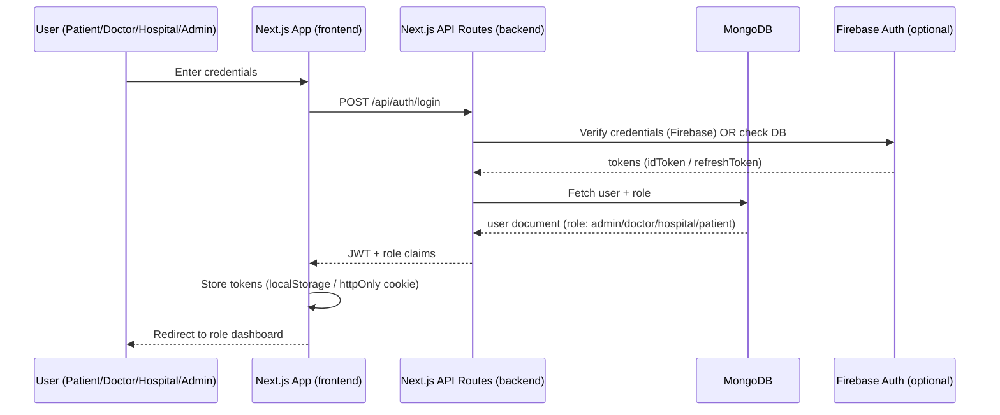
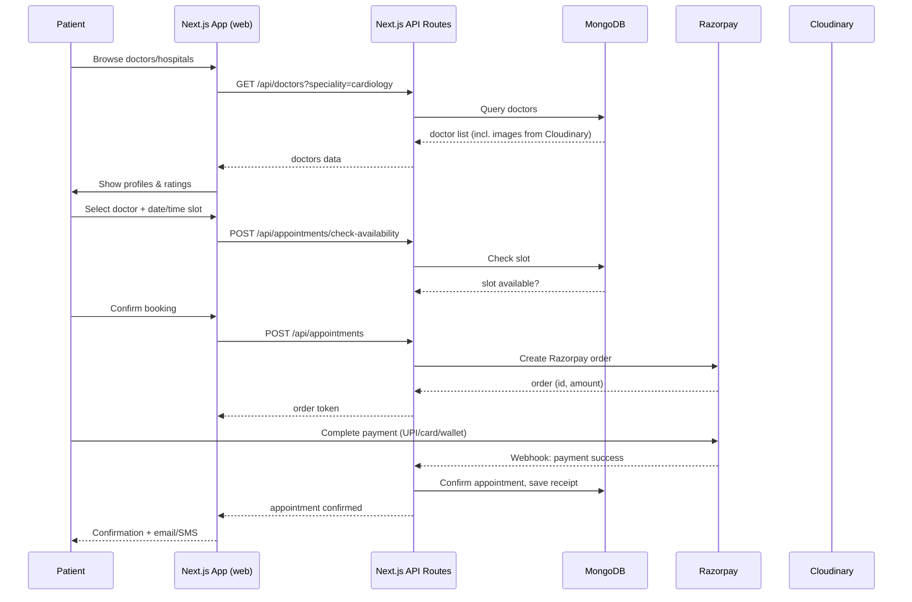
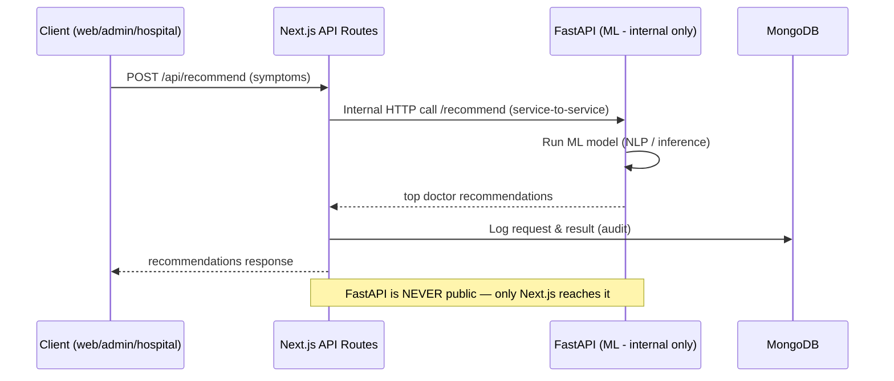
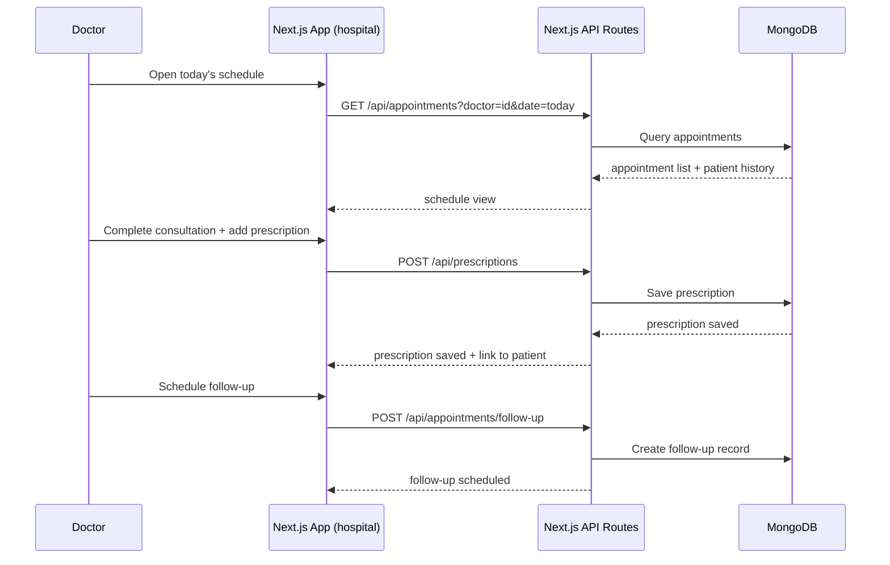

# HealHub - Project Architecture Guide

## 1. Existing Project Analysis (hospital-managment-website)

### Tech Stack Summary

| Layer | Technology | Version |
|-------|-----------|---------|
| **Frontend** | React | 19.x |
| **Build Tool** | Vite | 7.x |
| **Styling** | Tailwind CSS | 4.x |
| **Routing** | React Router | 7.x |
| **HTTP Client** | Axios | 1.x |
| **Backend** | Node.js + Express | 5.x |
| **Database** | MongoDB | - |
| **ORM** | Mongoose | 8.x |
| **Auth** | JWT | 9.x |
| **Payments** | Razorpay | 2.x |
| **File Storage** | Cloudinary | 2.x |

### Current Structure (MERN Stack)

```
hospital-managment-website/
├── frontend/          # Patient-facing React app
├── admin/             # Admin panel React app
├── backend/           # Express API server
└── README.md
```

**Limitation**: Only supports 2 frontends (patient + admin). Adding more (hospital/clinic) requires code duplication.

---

## 2. Next.js Project Structure

### Why Next.js?

- Full-stack framework (frontend + API routes)
- Server-side rendering (SSR) & static generation (SSG)
- Built-in API routes
- Better SEO
- Image optimization
- Middleware support

### Minimal Structure (Single Project)

```
my-app/
├── app/                    # App Router (Next.js 13+)
│   ├── (auth)/             # Route group for auth pages
│   │   ├── login/
│   │   │   └── page.tsx
│   │   └── register/
│   │       └── page.tsx
│   ├── dashboard/
│   │   ├── layout.tsx
│   │   └── page.tsx
│   ├── api/                # API routes (backend)
│   │   ├── users/
│   │   │   └── route.ts
│   │   └── auth/
│   │       └── route.ts
│   ├── layout.tsx          # Root layout
│   ├── page.tsx            # Home page
│   └── globals.css
├── components/             # Reusable UI components
│   ├── ui/                 # Base components (button, input)
│   └── features/           # Feature-specific components
├── lib/                    # Utilities & configs
│   ├── db.ts               # Database connection
│   ├── auth.ts             # Auth helpers
│   └── utils.ts
├── hooks/                  # Custom React hooks
├── types/                  # TypeScript types
├── public/                 # Static assets
├── middleware.ts            # Auth/route protection
├── next.config.ts
├── tailwind.config.ts
├── package.json
└── .env.local              # Environment variables
```

### Key Commands

```bash
# Create Next.js app
npx create-next-app@latest my-app --typescript --tailwind --app --src-dir

# Start dev server
npm run dev

# Build for production
npm run build

# Start production server
npm start
```

### Database Setup (Prisma + PostgreSQL/MongoDB)

```
lib/
├── prisma/
│   └── schema.prisma       # DB schema
└── db.ts                   # Prisma client singleton
```

```bash
npm install prisma @prisma/client
npx prisma init
```

---

## 3. Single Project vs Monorepo

### Comparison Table

| Factor | Single Project | Monorepo |
|--------|---------------|----------|
| **Best for** | 1 frontend | Multiple frontends |
| **Code sharing** | Manual copy | Shared packages |
| **Dependencies** | Separate installs | Unified management |
| **Deployment** | Simple | Per-app deployment |
| **Scalability** | Limited | High |
| **Team collaboration** | Hard | Easy |

### Verdict for HealHub

**Monorepo wins** because:
- 3+ websites (patient, admin, hospital)
- Shared types and components
- Single API serves all frontends
- Independent deployment per app

---

## 4. Recommended Monorepo Structure

```
healhub/
├── apps/
│   ├── web/                    # Patient-facing website
│   │   ├── app/
│   │   ├── components/
│   │   └── package.json
│   ├── admin/                  # Admin CMS panel
│   │   ├── app/
│   │   ├── components/
│   │   └── package.json
│   ├── hospital/               # Hospital/clinic panel
│   │   ├── app/
│   │   ├── components/
│   │   └── package.json
│   └── api/                    # Backend (single API for all)
│       ├── src/
│       │   ├── routes/
│       │   ├── controllers/
│       │   ├── models/
│       │   └── middleware/
│       └── package.json
├── packages/
│   ├── ui/                     # Shared UI components
│   │   ├── Button.tsx
│   │   └── package.json
│   ├── types/                  # Shared TypeScript types
│   │   ├── user.ts
│   │   ├── appointment.ts
│   │   └── package.json
│   └── config/                 # Shared configs
│       ├── eslint/
│       └── tsconfig/
├── package.json                # Root (workspace)
├── turbo.json                  # Turborepo config
├── pnpm-workspace.yaml
└── .env.local
```

### Shared Code Example

```typescript
// packages/types/user.ts
export interface User {
  id: string;
  name: string;
  email: string;
  role: 'patient' | 'doctor' | 'hospital' | 'admin';
}

// apps/web/app/profile/page.tsx
import { User } from '@healhub/types';

// apps/admin/app/users/page.tsx
import { User } from '@healhub/types';
```

---

## 5. Deployment Options

### Option 1: Vercel + Render (Recommended)

| App | Platform | URL |
|-----|----------|-----|
| apps/web | Vercel | healhub.com |
| apps/admin | Vercel | admin.healhub.com |
| apps/hospital | Vercel | hospital.healhub.com |
| apps/api | Render | api.healhub.com |

**Pros**: Easy setup, free tier, auto-deploy from GitHub
**Cons**: Vendor lock-in, costs at scale

### Option 2: Docker Compose (Self-hosted)

```yaml
# docker-compose.yml
services:
  web:
    build: ./apps/web
    ports: ["3000:3000"]
  admin:
    build: ./apps/admin
    ports: ["3001:3001"]
  hospital:
    build: ./apps/hospital
    ports: ["3002:3002"]
  api:
    build: ./apps/api
    ports: ["4000:4000"]
  mongodb:
    image: mongo:7
    ports: ["27017:27017"]
```

**Pros**: Full control, cheaper long-term
**Cons**: Server management, manual scaling

### Option 3: Kubernetes (Enterprise)

- Each app as separate pod
- Auto-scaling
- Load balancing
- Best for: Large teams, high traffic

### Deployment Comparison

| Approach | Cost | Complexity | Best For |
|----------|------|------------|----------|
| Vercel + Render | Free/low | Easy | Startups, MVPs |
| Docker Compose | Medium | Medium | Small-medium apps |
| Kubernetes | High | Complex | Enterprise |

---

## 6. Quick Start Commands

### Create Monorepo

```bash
# Create root directory
mkdir healhub && cd healhub
pnpm init

# Install Turborepo
pnpm add -Dw turbo

# Create workspace config
echo 'packages:
  - "apps/*"
  - "packages/*"' > pnpm-workspace.yaml

# Create apps
pnpm create next-app apps/web --typescript --tailwind --app
pnpm create next-app apps/admin --typescript --tailwind --app
pnpm create next-app apps/hospital --typescript --tailwind --app

# Create backend
mkdir -p apps/api/src && cd apps/api && npm init -y
```

### Install Shared Dependencies

```bash
# From root
pnpm add -w typescript
pnpm add -w -D @types/node
```

### Run All Apps

```bash
# Start all apps in parallel
pnpm turbo dev

# Start specific app
pnpm turbo dev --filter=web
```

---

## 7. Environment Variables

### apps/web/.env.local
```env
NEXT_PUBLIC_API_URL=http://localhost:4000
NEXT_PUBLIC_RAZORPAY_KEY=your_key
```

### apps/api/.env
```env
PORT=4000
MONGODB_URI=mongodb://localhost:27017/healhub
JWT_SECRET=your_secret
CLOUDINARY_URL=your_url
```

---

## 8. Backend Decision: Next.js API Routes vs Express vs FastAPI vs Flask

### Head-to-Head Comparison

#### Security

| Factor | Next.js API Routes | Express | FastAPI | Flask |
|--------|-------------------|---------|---------|-------|
| Built-in auth helpers | ✅ (Auth.js) | ⚠️ manual | ✅ (OAuth2) | ❌ manual |
| Input validation | ⚠️ manual (add Zod) | ⚠️ manual | ✅ auto (Pydantic) | ❌ manual |
| CSRF protection | ✅ | ❌ | ❌ | ❌ |
| Rate limiting | ⚠️ needs setup | ⚠️ needs setup | ⚠️ needs setup | ⚠️ needs setup |
| Mature security defaults | ✅ | ⚠️ | ⚠️ | ❌ |
| **Rank** | **🥇 1st** | 3rd | 2nd | 4th |

#### Speed (Runtime Performance)

| Factor | Next.js Routes | Express | FastAPI | Flask |
|--------|---------------|---------|---------|-------|
| Raw throughput | Medium (Node) | Medium (Node) | **Very High** (async, compiled) | Low |
| Request concurrency | ⚠️ single-threaded | ⚠️ single-threaded | ✅ multi | ⚠️ sync default |
| Static/SSR speed | ✅ fast | n/a | n/a | n/a |
| **Rank** | 3rd | 2nd | **🥇 1st** | 4th |

> **Note**: FastAPI is genuinely faster for pure API compute. But for a CRUD-heavy CMS/healthcare app, the **database is the bottleneck, not the framework** — the speed gap rarely matters in practice.

#### Reliability & Robustness

| Factor | Next.js Routes | Express | FastAPI | Flask |
|--------|---------------|---------|---------|-------|
| Middleware ecosystem | ✅ | ✅ huge | ✅ | ⚠️ small |
| Error handling | ✅ | ⚠️ manual | ✅ auto | ⚠️ manual |
| Auto docs (Swagger) | ⚠️ | ❌ | ✅ automatic | ❌ |
| Type safety integration | ✅ TS | ⚠️ TS optional | ✅ | ⚠️ |
| **Rank** | **🥇 1st** | 3rd | 2nd | 4th |

#### Simplicity (Dev Speed & DX)

| Factor | Next.js Routes | Express | FastAPI | Flask |
|--------|---------------|---------|---------|-------|
| Setup time | ⚠️ (comes w/ Next project) | ✅ fast | ✅ fast | ✅ fast |
| Learning curve | ⚠️ moderate | ✅ easy | ✅ easy | ✅ easy |
| One language with frontend | ✅ (TS/JS) | ✅ (TS/JS) | ❌ (Python) | ❌ (Python) |
| Shared types with frontend | ✅ | ✅ | ❌ | ❌ |
| **Rank** | **🥇 1st** | 2nd | 3rd | 4th |

### Category Winners

| Concern | Winner |
|---------|--------|
| **Most secure** | Next.js API Routes |
| **Fastest raw speed** | FastAPI (irrelevant for CRUD apps) |
| **Most reliable/robust** | Next.js API Routes |
| **Simplest to build & maintain** | Next.js API Routes |
| **Best for Healhub** | **Next.js API Routes** |

### Why Next.js API Routes Win for Healhub

1. **One language** — Frontend already uses TypeScript. No context-switching to Python.
2. **Shared types** — `User`, `Appointment`, `Billing` types live in `packages/types` and are used by both frontend and backend. FastAPI/Flask can't do this.
3. **No CORS config** — Frontend and API are in the same Next.js app.
4. **Serverless-ready** — Vercel scales each route automatically.
5. **Security defaults** — Streaming, edge caching, Auth.js, built-in CSRF/header handling.

### When Alternatives Make Sense

| Framework | Choose It If... |
|-----------|-----------------|
| **FastAPI** | Planning AI/ML features, or CPU-heavy compute where Python libraries shine |
| **Express/Fastify** | The API grows huge and you want to split it into standalone `apps/api` with full framework freedom |

---

## 9. Backend Recommendation Summary

```
Runtime     : Node.js (LTS - 20/22)
Language    : TypeScript
Framework   : Next.js API Routes
Validation  : Zod
DB Access   : Prisma
Database    : PostgreSQL (Supabase/Neon hosting)
Auth        : Auth.js / custom JWT + RBAC (Access + Refresh tokens)
Caching     : Redis (optional)
```

### Recommended Backend Stack by Concern

| Concern | Best Choice | Why |
|---------|-------------|-----|
| Runtime | Node.js (LTS) | One language end-to-end |
| Language | TypeScript | Type safety across all apps |
| Framework | Next.js Routes → Fastify (if separate) | Same stack, fast dev |
| Database | PostgreSQL | Relational integrity for medical/billing data |
| ORM | Prisma | Type-safe, auto-migrations |
| Validation | Zod | Secure API boundaries |
| Auth | Auth.js / JWT + refresh | 4-role RBAC support |
| Hosting | Railway / Render / Supabase (DB) | Cheap, auto-scaling |

---

## 10. Summary

| Decision | Recommendation |
|----------|----------------|
| **Framework** | Next.js 14+ (App Router) |
| **Structure** | Monorepo with Turborepo |
| **Package Manager** | pnpm (workspace support) |
| **Deployment** | Vercel (frontend) + Render (API) |
| **Database** | MongoDB Atlas or PostgreSQL |
| **Styling** | Tailwind CSS |
| **Shared Code** | packages/types, packages/ui |

---

## 11. ✅ Final Decided Stack

> This is the stack we are committing to for Healhub. It's a decision made **for simplicity + extensibility**: start fast with a well-known unified stack, and leave room to add FastAPI for AI/ML later.

### Frontend (All 3 Apps: web / admin / hospital)
| Technology | Purpose |
|-----------|---------|
| Next.js 14+ (App Router) | Framework (SSR/SSG/API routes) |
| TypeScript | Language (type safety end-to-end) |
| Tailwind CSS | Styling utility-first |
| shadcn/ui | Prebuilt accessible UI components |
| Framer Motion | Animation library |
| Lenis | Smooth scrolling |
| React Hook Form | Form handling |
| TanStack Query | Server-state / data fetching |
| Zustand | Client-side state management |
| Axios | HTTP client |

### Backend
| Technology | Purpose |
|-----------|---------|
| Node.js (LTS) | Runtime |
| Next.js API Routes | Primary REST API (auth, CRUD, billing) |
| **FastAPI (later)** | AI/ML features — added only when ML ships |
| Mongoose | ODM for MongoDB |
| Zod | Validation at API boundaries |

### Database
| Technology | Purpose |
|-----------|---------|
| **MongoDB** | Primary NoSQL database (flexible documents for healthcare data) |
| Mongoose | ODM / schema modeling |
| **Firebase Firestore** | Optional real-time / serverless database (auth, realtime sync) |

> **Decision rationale**: We chose MongoDB/Firestore (NoSQL) for developer velocity and flexible schemas over the earlier PostgreSQL recommendation. Healthcare records are evolving, and NoSQL lets us iterate faster without migrations. Firestore adds real-time sync + serverless auth if we need it.

### Auth
Auth.js (NextAuth) or Firebase Auth, with role-based access control (RBAC) for 4 roles: admin, doctor, hospital, patient.

### Payments
- **Razorpay** (India) — primary payment gateway

### File Storage
- **Cloudinary** — image storage & optimization

### Architecture: Hybrid Backend (Next.js + FastAPI later)

```
web/admin/hospital → Next.js API routes (auth, CRUD, billing, DB)
                          │
                          │ HTTP call (internal only)
                          ▼
                     FastAPI (AI/ML only) — added later
```

- **Start with Next.js only** — build all REST/CRUD there.
- **Add FastAPI later** when real ML ships (doctor recommender, symptom analysis).
- **Never expose FastAPI to public** — only Next.js talks to it.

### Deployment
| App | Platform |
|-----|----------|
| web | Vercel |
| admin | Vercel |
| hospital | Vercel |
| Next.js API routes | Vercel (same deploys) |
| FastAPI (later) | Railway / Render |
| MongoDB | MongoDB Atlas |
| Firebase | Firebase project |

### Monorepo Layout (with this stack)

```
healhub/
├── apps/
│   ├── web/            # Next.js patient site
│   ├── admin/          # Next.js admin CMS
│   ├── hospital/       # Next.js hospital/clinic panel
│   └── ml-api/         # FastAPI (added later, AI/ML only)
├── packages/
│   ├── ui/             # Shared shadcn/ui components
│   ├── types/          # Shared TS types
│   └── config/         # Shared eslint/tsconfig
├── package.json        # Workspace root
├── turbo.json
└── pnpm-workspace.yaml
```

---

## 12. Sequence Diagrams

> All diagrams use [Mermaid](https://mermaid.js.org) syntax — they render natively on GitHub.

### 12.1 Authentication (Login & RBAC)



### 12.2 Patient Booking Journey (with Payment)



### 12.3 Hybrid Backend — Next.js + FastAPI (AI/ML)



### 12.4 Doctor Prescription & Follow-up



---

## 13. References

- [Next.js Docs](https://nextjs.org/docs)
- [Turborepo Docs](https://turbo.build/repo/docs)
- [shadcn/ui](https://ui.shadcn.com)
- [Framer Motion](https://motion.dev)
- [Lenis](https://lenis.darkroom.engineering)
- [Zod](https://zod.dev)
- [Mongoose](https://mongoosejs.com)
- [MongoDB](https://www.mongodb.com)
- [Firebase](https://firebase.google.com)
- [Vercel Deployment](https://vercel.com/docs)
